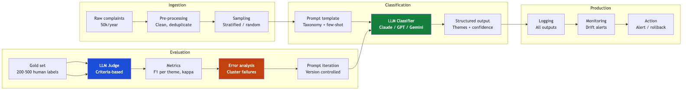

# UC1: Complaint Theme Classification — Overview

> **System:** LLM classifier assigning regulatory themes to 50,000+ formal property complaints per year
> **Domain:** NSW property law — agents, strata managers, pricing conduct

---

## The business problem

A regulatory body receives over 50,000 formal complaints per year about property agents, strata managers, and related conduct. Manually reading and categorising each complaint is not scalable. An LLM-powered classifier must assign one or more themes from a controlled taxonomy to each complaint, enabling analytics, workload routing, and trend reporting.

---

## System architecture

---

## Deidentified examples

See: [Deidentified Examples](deidentified-examples)

---

## The multi-label challenge

Both illustrative examples share the same 5 themes. The most common failure mode for this system is **single-label output on multi-theme complaints**. The classifier must:

1. Recognise that a complaint can justify multiple themes simultaneously
2. Apply all applicable themes, not just the most prominent one
3. Not apply themes that are not supported by the complaint text

---

## Quick reference

| Page | Content |
|---|---|
| [Deidentified Examples](deidentified-examples) | Two anonymised complaint examples with correct theme labels |
| [The Taxonomy](the-taxonomy) | Full theme list with definitions and boundary examples |
| [Eval Design Step by Step](eval-design-step-by-step) | 8-step process from gold set to CI/CD |
| [Metrics](metrics) | F1 per theme, kappa, multi-label coverage, cost |

---

*Next: [Deidentified Examples](deidentified-examples)*
