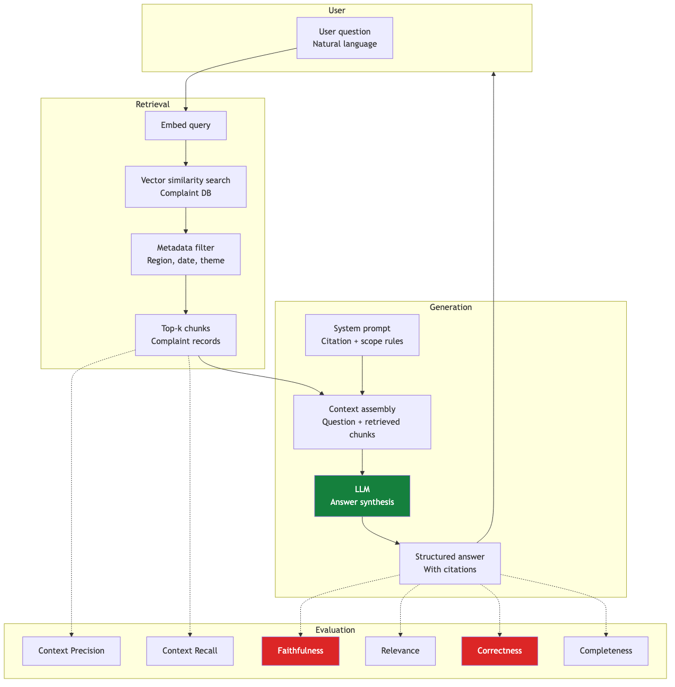

# UC2: RAG Chatbot — Overview

> **System:** Conversational chatbot allowing regulatory staff to query complaint data without writing SQL
> **Backend:** Vector database over complaint records; LLM synthesises natural language answers

---

## Example queries this system must handle

| Query type | Example | Core eval challenge |
|---|---|---|
| Count query | "How many complaints were received in 2025-2026?" | Answer correctness (exact match) |
| Regional filter | "Any complaints from the Western Sydney region?" | Context recall + correctness |
| Theme breakdown | "What are the most common complaint themes this quarter?" | Faithfulness + completeness |
| Combined | "Nature and volume of complaints from Eastern Suburbs 2025?" | All 6 RAG evals |
| Temporal | "How has the volume of underquoting complaints changed year on year?" | Recall + correctness + completeness |

---

## Architecture

---

## Key design constraints (regulatory context)

- **Zero hallucination tolerance** — incorrect counts or trends could influence regulatory enforcement decisions
- **Transparency required** — every factual claim must cite the source complaint record
- **Date range precision** — FY 2025-26 vs calendar year must be explicitly disambiguated
- **Geography normalisation** — "Western Sydney" is not a single entity; must be normalised to postcodes or LGAs at indexing time

---

## Quick reference

| Page | Content |
|---|---|
| [RAG Architecture](rag-architecture) | Pipeline design and data flow |
| [The 6 RAG Evals](the-6-rag-evals) | Full coverage of all 6 evals with chatbot examples |
| [Building Test Set](building-test-set) | How to build a ground-truth Q&A set for this system |
| [Failure Modes](failure-modes) | Common failure clusters and root causes |

---

*Next: [RAG Architecture](rag-architecture)*
