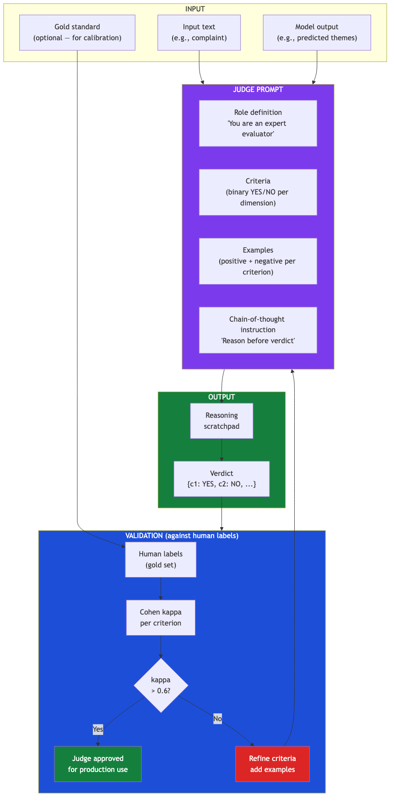
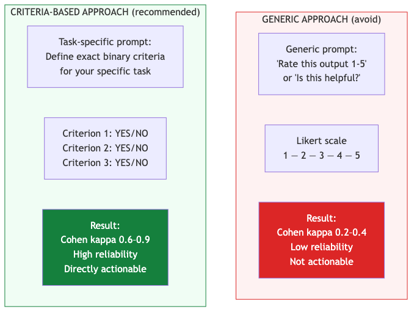
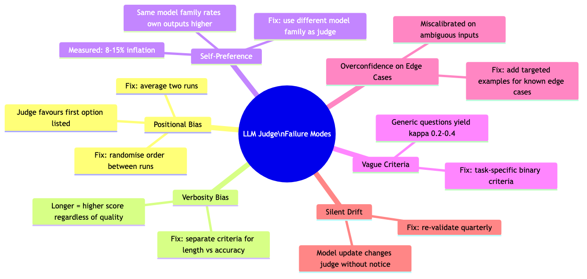
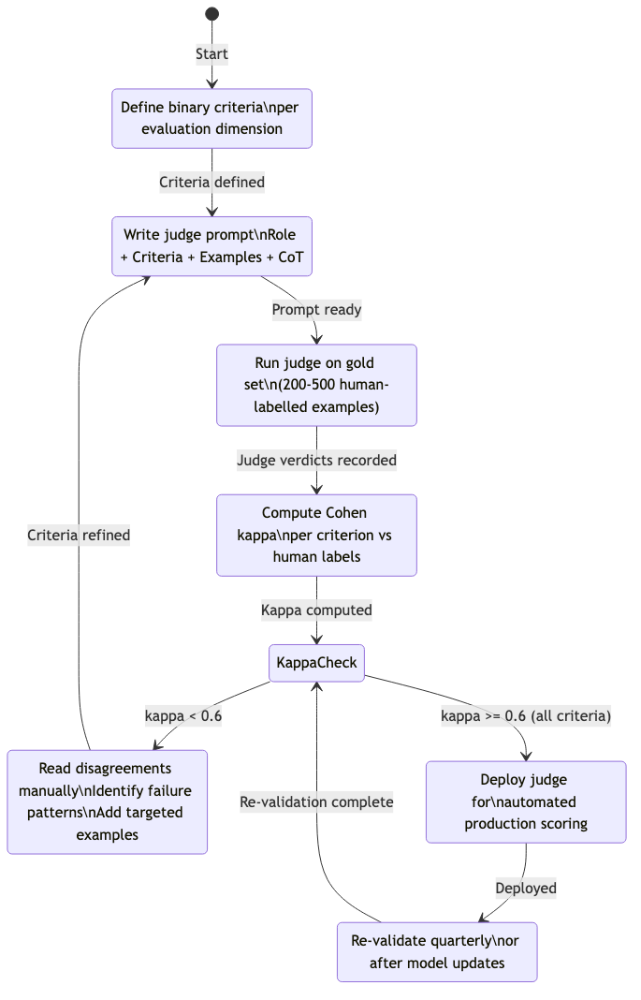
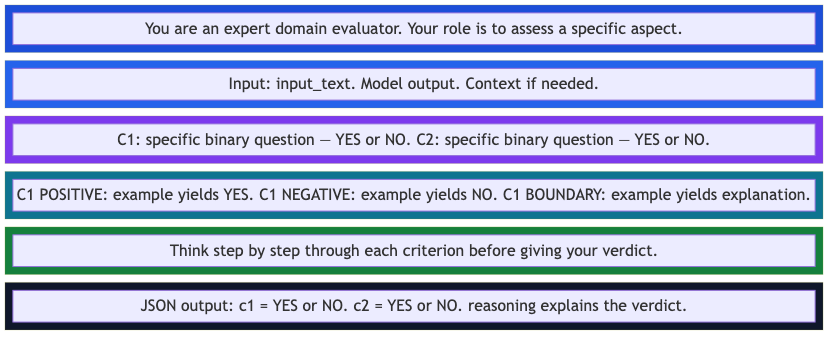
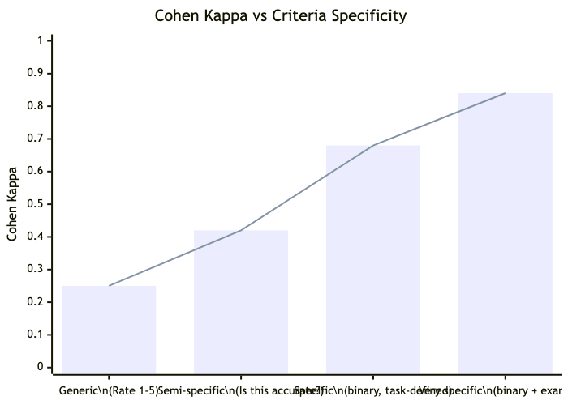

# Hamel LLM Judge — Diagram Recreation

> **Source:** Hamel Husain — [Your AI Product Needs Evals](https://hamel.dev/blog/posts/llm-judge/)
> **Access status:** `hamel.dev` was **not reachable** from the build environment (network allowlist restriction).
> **Action taken:** All diagrams from this post have been **recreated from source knowledge** using Mermaid below.

---

## Diagram 1: The Core LLM Judge Pipeline

*Recreated from hamel.dev — the primary pipeline diagram showing how an LLM judge evaluates outputs*

---

## Diagram 2: Criteria-Based Evaluation vs Generic Scoring

*Recreated — hamel.dev's comparison of task-specific binary criteria vs generic Likert-scale approaches*

---

## Diagram 3: Failure Mode Taxonomy

*Recreated — hamel.dev's taxonomy of LLM judge failure modes*

---

## Diagram 4: The Validation Loop (eugeneyan.com + Hamel combined)

*Recreated — the iterative validation process for getting a judge to production quality*

---

## Diagram 5: Judge Prompt Anatomy

*Recreated — the structural components of an effective LLM judge prompt*

---

## Diagram 6: Agreement Rate vs Criteria Specificity (hamel.dev finding)

*Recreated — empirical relationship between criteria specificity and inter-rater agreement*

> **Key insight from Hamel Husain:** The relationship between criteria specificity and judge reliability is not linear — it is step-function. Generic criteria plateau at kappa ~0.3. Binary criteria jump immediately to 0.6+. Examples push it further to 0.8+.

---

## How to access the original content

Since `hamel.dev` was not accessible at build time, access the original post directly:
- **URL:** https://hamel.dev/blog/posts/llm-judge/
- **Also valuable:** https://hamel.dev/blog/posts/evals-faq/
- **YouTube:** [LLM Judges Aren't the Shortcut You Think](https://www.youtube.com/watch?v=sEMYSSS6Ims)

---

*Back to: [Diagrams index](eval-pipeline-architecture)*
