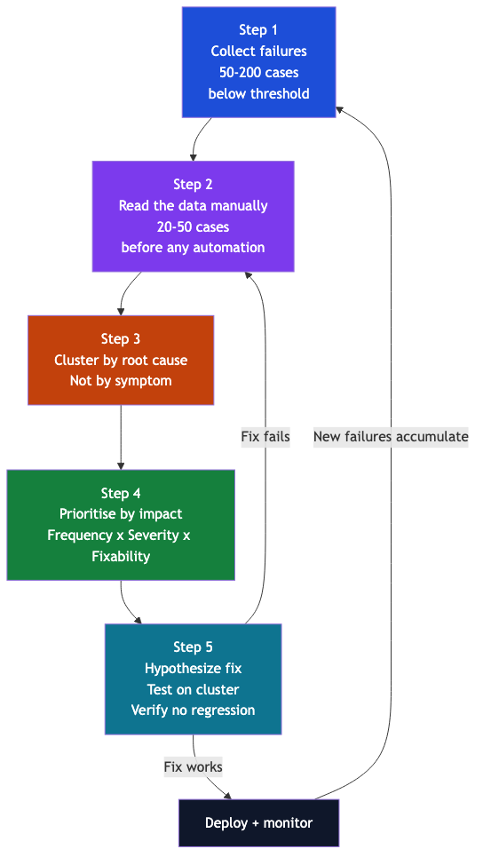

# Error Analysis: The Highest ROI Technique

> *"Do not trust your dashboard. Read your data."* — Hamel Husain

Error analysis is the practice of understanding **why** a system fails, not just **how often**. It is the highest ROI activity in AI engineering.

---

## Why error analysis has the highest ROI

A single error analysis session routinely reveals that 80% of failures trace to 2–3 root causes, each fixable with a targeted prompt change. Compare this to:

- Switching models: expensive, time-consuming, often marginal gains
- Generic prompt tuning: unfocused; can regress other cases
- Adding more training data: weeks of effort for uncertain gain

Error analysis takes 2–4 hours and often produces a single-line prompt change that eliminates 60–70% of failures.

---

## The 5-step framework

---

## The critical step: reading the data (Step 2)

Most teams skip straight to clustering tools. This is a mistake. Reading 20–50 cases manually gives you:

1. **Intuition about failure patterns** that automated clustering cannot provide
2. **Hypotheses** about root causes to test against the full failure set
3. **Edge cases** that reveal taxonomy gaps or prompt ambiguities
4. **Context** — you understand what the model "sees" vs what a human sees

You cannot outsource this step to an LLM summariser. The act of reading is the analysis.

---

## Error cluster prioritisation matrix

| Cluster | Frequency | Business severity | Fixability | Priority score | Action |
|---|---|---|---|---|---|
| Multi-label gap | High | High (regulatory reports wrong) | High (prompt change) | 9 | Fix first |
| Taxonomy boundary confusion | Medium | Medium | Medium (add examples) | 6 | Fix second |
| Indirect language missed | Low | High (underquoting cases) | High (few-shot) | 7 | Fix third |
| Novel theme type | Low | Low | Low (taxonomy expansion) | 2 | Backlog |

**Priority score** = Frequency (1-3) × Severity (1-3) × Fixability (1-3)

---

## Detailed use-case case studies

See: [Case Studies](case-studies.md) — error analysis applied to both UC1 (complaint classifier) and UC2 (RAG chatbot)

---

*Next: 5-Step Framework*
