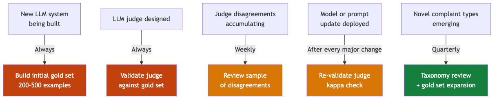

# Human Evals

Human evaluation is the gold standard. It is also expensive and slow. Use it strategically: for building calibration data, not for routine scoring.

---

## When human eval is required

---

## Human eval cadence (recommended)

| Activity | Frequency | Volume | Who |
|---|---|---|---|
| Build initial gold set | Once (project start) | 200–500 examples | 2+ domain experts |
| Validate LLM judge | At judge design + major changes | Full gold set | 1 domain expert |
| Review judge disagreements | Weekly | 20–50 cases | 1 reviewer |
| Sample production outputs | Monthly | 1–2% of traffic | 1 reviewer |
| Taxonomy audit | Quarterly | All themes | Domain expert + product owner |

---

## Reducing inter-annotator disagreement

High disagreement between human annotators is a signal that your **criteria need refinement**, not that your annotators are wrong.

Steps to reduce disagreement:
1. Write explicit definitions for each theme with inclusion and exclusion examples
2. Conduct a calibration session — annotators label the same 20 examples, then discuss disagreements
3. Document resolution rules for known boundary cases
4. Track disagreement rate over time — it should decrease as definitions improve

**Target:** Inter-annotator agreement (Cohen kappa) > 0.7 before using a gold set to validate your LLM judge.

---

## Human eval for our use cases

### UC1 — Complaint Classifier
Reviewers need: the full complaint text, the predicted theme list, the taxonomy with definitions, and a simple YES/NO form per criterion. Do **not** show reviewers the model's reasoning — it anchors their judgment.

### UC2 — RAG Chatbot
Reviewers need: the question, the retrieved context chunks, and the generated answer. They evaluate: (1) Is the answer factually correct? (2) Is every claim supported by the retrieved context? (3) Does the answer fully address the question?

---

*Back: [LLM-as-Judge](../llm-judges/llm-as-judge-complete-guide.md) | Next section: [UC1 Overview](../applied/uc1-complaint-classification.md)*
