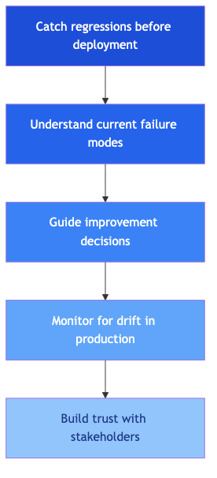

# Why Evaluations Matter

> *"Without evals, you are flying blind. With bad evals, you are flying with a broken altimeter."* - Hamel Husain

---

## The core problem

LLM outputs exist on a spectrum of quality. Unlike traditional software tests that pass or fail deterministically, client feedback classifier that labels themes or a chatbot that answers business queries produces outputs that can be correct, partially correct, or wrong in subtle ways that a simple pass/fail test cannot capture.

Without systematic evaluation, teams discover failures **reactively** - after users have already been harmed by incorrect outputs. The goal of evaluation engineering is to move failure discovery from production to development.

---

## Why this matters for our two use cases

| System | Silent failure mode | Business consequence |
|---|---|---|
| **UC1: Client Feedback classifier** | Billing Discrepancy theme missed on 15% of client feedback | Business reports misrepresent prevalence; wrong workload routing |
| **UC2: RAG chatbot** | Hallucinated feedback count for Western Sydney | Decision-maker acts on incorrect data; trust in system destroyed |

---

## The fundamental question: what does "good" mean?

For a classifier labelling 100,000+ client feedback per year, "good" means:
- Correct themes applied according to internal taxonomy definitions
- All relevant themes captured (multi-label completeness)
- No fabricated themes appear in output
- Consistent enough for downstream analytics

For a chatbot answering business queries, "good" means:
- Factually correct against source data
- Grounded in retrieved records (no hallucination)
- Responsive to the specific question asked
- Complete across all dimensions of a multi-part question

**A single accuracy score captures none of this.** Task-specific, multi-dimensional evaluation is required.

---

## The evaluation purpose hierarchy

---

## Evals are NOT all you need

From Reganti & Badam (O'Reilly, 2025): evaluation scores are necessary but not sufficient.

**What evals cannot do:**
- Measure everything that matters to your users
- Replace human judgment on high-stakes edge cases
- Detect failure modes you haven't imagined yet
- Close the production feedback loop on their own

**What you need alongside evals:**
- Observability (logging, tracing, monitoring)
- Human review of sampled outputs
- Error analysis to understand root causes
- Ongoing taxonomy maintenance as the domain evolves

> **Applied to UC1:** A feedback labelling system serving an organisation must combine automated evals (accuracy, precision, recall per theme), human review of edge cases, and ongoing monitoring of label distribution drift as new types of client feedback emerge.

---

## Key sources

- Hamel Husain - [LLM Evals FAQ](https://hamel.dev/blog/posts/evals-faq/)
- Reganti & Badam - [Evals Are NOT All You Need](https://www.oreilly.com/radar/evals-are-not-all-you-need/) (O'Reilly, 2025)
- Habib - [Why Your AI Product Needs Evals](https://humanloop.com/blog/why-your-product-needs-evals) (Humanloop, 2024)

---

*Next: [Eval Maturity Ladder](eval-maturity-ladder.md)*
