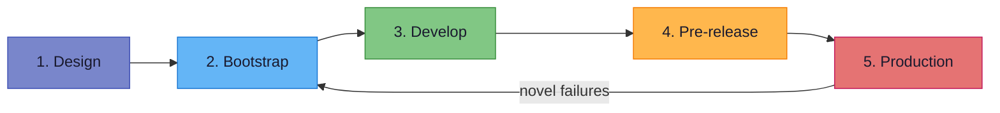
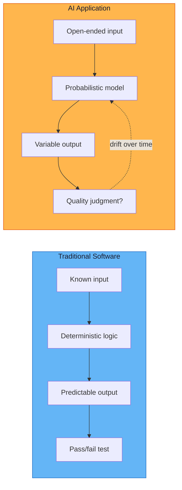
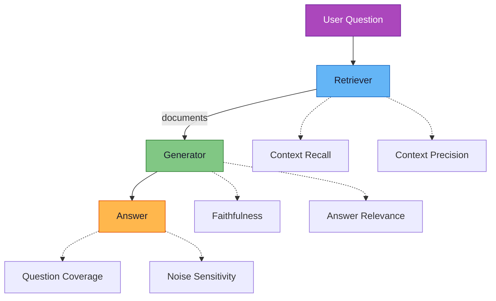
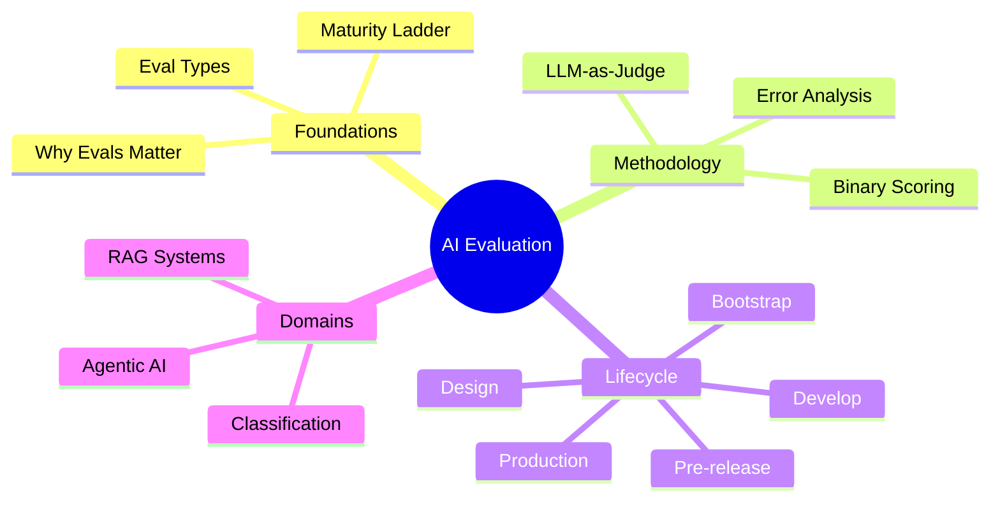

# AI Evaluators

**A complete guide to evaluating AI systems in production.**

---

-   :material-eye-check:{ .lg .middle } **Why Evals Matter**

    ---

    Without evaluation, teams operate on "vibe checking" - reading ten outputs and deciding things look fine. That does not survive contact with real users.

    [:octicons-arrow-right-24: Foundations](foundations/why-evals-matter.md)

-   :material-layers-triple:{ .lg .middle } **The Eval Lifecycle**

    ---

    Five phases: Design, Bootstrap, Develop, Pre-release, Production. The lifecycle is a circle, not a line.

    [:octicons-arrow-right-24: Lifecycle](lifecycle/integrating-evals.md)

-   :material-scale-balance:{ .lg .middle } **LLM-as-Judge**

    ---

    A second language model scoring the first against written criteria. Scales human judgment to thousands of examples - with known failure modes and mitigations.

    [:octicons-arrow-right-24: LLM Judges](llm-judges/llm-as-judge-complete-guide.md)

-   :material-chart-scatter-plot:{ .lg .middle } **Metrics That Work**

    ---

    Binary evals yield kappa 0.6–0.9. Likert scales yield kappa 0.2–0.4. Generic metrics (BLEU, ROUGE) do not predict task success.

    [:octicons-arrow-right-24: Metrics](metrics/binary-vs-likert.md)

---

## The AI Evaluation Lifecycle

> *"Without evals, you are flying blind. With bad evals, you are flying with a broken altimeter."*
> - Hamel Husain

| Phase | Key Question | Output |
|---|---|---|
| **Design** | What does "good" mean? | Binary criteria + thresholds |
| **Bootstrap** | How do we start without data? | Synthetic eval set (50–100 examples) |
| **Develop** | Is this change better? | Unit evals + LLM judge scores |
| **Pre-release** | Does this generalize? | Regression test pass + PDE sign-off |
| **Production** | Is it still working? | Drift alerts + novel failure capture |

---

## Architecture: Traditional Testing vs AI Evaluation

AI applications break the three properties of traditional software: **determinism**, **traceable errors**, and **temporal stability**. Evaluation is the discipline of turning subjective quality judgments into measurable, auditable evidence.

---

## Specialised Evaluation Domains

### RAG Applications

RAG systems fail in two independent stages - retrieval can return wrong documents, or the model can ignore right ones. Six metrics cover the full failure surface:

[:octicons-arrow-right-24: The 6 RAG Evals](applied/uc2-the-6-rag-evals.md)

### Agentic Systems

Agents take multiple steps - calling tools, reading outputs, deciding the next action. Evaluation must assess the entire **trajectory**, not just the final output.

[:octicons-arrow-right-24: Demystifying Agent Evals](agent-evals/demystifying-agent-evals.md)

---

## Who This Is For

| Role | What you'll find |
|---|---|
| **Engineering Managers** | Decision frameworks for eval programme design |
| **ML/AI Engineers** | Implementation patterns, code-level guidance |
| **Product Owners** | ROI arguments, maturity ladders, lifecycle integration |
| **Data Scientists** | Metric selection, statistical validation protocols |

---

## Quick Start

1. **New to evals?** Start with [Why Evals Matter](foundations/why-evals-matter.md) and the [Eval Maturity Ladder](foundations/eval-maturity-ladder.md)
2. **Building your first eval set?** See [Build a Dataset from Scratch](building-evals/build-dataset-from-scratch.md)
3. **Designing an LLM judge?** Follow the [Complete Guide](llm-judges/llm-as-judge-complete-guide.md)
4. **Evaluating a RAG system?** Use the [RAG Eval Coverage Checklist](checklists/rag-eval-coverage.md)
5. **Need a pre-flight check?** Browse [all checklists](checklists/eval-design.md)

---

## Key Concepts

---

-   :material-clipboard-check:{ .lg .middle } **Checklists**

    ---

    Pre-flight checks for eval design, judge quality, error analysis, and RAG coverage.

    [:octicons-arrow-right-24: View checklists](checklists/eval-design.md)

-   :material-chart-timeline:{ .lg .middle } **Diagrams**

    ---

    Architecture diagrams, workflow visualizations, and framework overviews.

    [:octicons-arrow-right-24: View diagrams](diagrams/eval-pipeline-architecture.md)

-   :material-book-open-page-variant:{ .lg .middle } **References**

    ---

    All source materials with access status, key contributions, and article mappings.

    [:octicons-arrow-right-24: View references](references.md)

