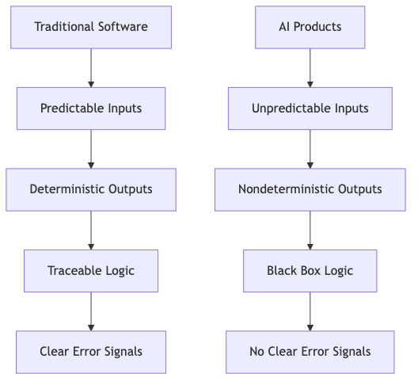
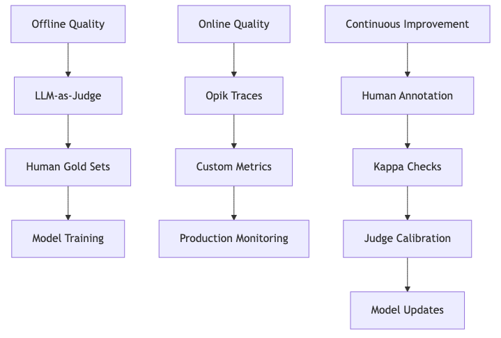

# Evals Are NOT All You Need

> *"Evals are only important in the context of product quality, and product quality is a process."* - Anonymous AI Product Lead

---

## The Evals Obsession

Evals have become the de facto solution for AI product quality. But this obsession with "building good evals" often misses the bigger picture: **product quality is a process**, not a checklist. This article explains why traditional testing fails for AI systems and introduces a framework for ensuring quality in AI products.

[Eval Maturity Ladder](../foundations/eval-maturity-ladder.md) highlights how teams often focus on metrics without addressing the systemic challenges of AI product development. This section expands on that by showing why evals alone are insufficient.

---

## Why Traditional Testing Breaks

Traditional software testing assumes predictable inputs and deterministic outputs. For example, booking a hotel on Booking.com involves predefined options (dates, cities, filters). Testing covers:

- **Offline quality**: Unit/integration tests before launch
- **Online quality**: Monitoring production errors with stack traces
- **Continuous improvement**: Fix bugs, retest, and ship

But AI products are fundamentally different:

**Key differences**:
- User inputs are unbounded (e.g., "Find a pet-friendly hotel in Austin for next weekend")
- Outputs are probabilistic (same input may yield different results)
- No stack traces - only confident-sounding answers that may be wrong

This creates a feedback loop where:
1. **Offline quality** is hard to estimate (can't anticipate all inputs)
2. **Online quality** is hard to measure (no clear error signals)
3. **Continuous improvement** is unreliable (fixes may break with new inputs)

---

## Model Versus Product

AI product quality involves two distinct layers:

### Model Layer
- Focus: General capabilities (reasoning, coding, factuality)
- Metrics: Benchmarks (MMLU, HumanEval, LMArena)
- Example: OpenAI's GPT-4 scores on coding tasks

### Product Layer
- Focus: Specific use cases (customer support, booking, RAG chatbots)
- Metrics: Task-specific (e.g., "Did the agent find the correct documentation link?")
- Example: Workpath AI Companion's tool call validation

**Critical insight**: Benchmark scores tell you what a model *can* do, not whether it *will* work for your product. A model might score 95% on a reasoning benchmark but fail on your product's edge cases.

---

## The Three Pillars of AI Product Quality

AI product quality requires a system that addresses:

### 1. Offline Quality
- **Goal**: Estimate behavior before deployment
- **Tools**: 
  - Unit evals (e.g., check for forbidden strings)
  - LLM-as-judge (e.g., validate RAG grounding)
  - Human gold sets (e.g., [Human Evals](../foundations/human-evals.md))

### 2. Online Quality
- **Goal**: Monitor real-world performance
- **Tools**:
  - Opik for trace visualization and anomaly detection
  - Custom metrics (e.g., "Did the agent hallucinate a URL?")
  - [AI Observability in Production](observability-in-production.md)

### 3. Continuous Improvement
- **Goal**: Create feedback loops that adapt to new inputs
- **Tools**:
  - Human annotation sessions (e.g., resolving judge disagreements)
  - Kappa checks for judge calibration
  - [Validation Protocol](../llm-judges/validation-protocol.md)

---

## The Mirage of "Good Evals"

Many teams treat "evals" as a magic bullet. But the term is misleading:

- **Evals ≠ Metrics**: A hallucination score of 1 is meaningless without context
- **Evals ≠ Testing**: Unit evals are not the same as unit tests
- **Evals ≠ Quality**: Task-specific metrics are needed, not generic ones

**The solution**: Build a **process** that includes:
1. Defining what "good" means for your product
2. Measuring it with the right tools at the right times
3. Learning from real-world failures
4. Closing the loop with fixes that stick

---

## Conclusion

Evals are a tool, not a goal. They must be part of a broader system that includes:
- [Unit evals](../foundations/unit-evals.md) for fast, deterministic checks
- [LLM-as-judge](../llm-judges/llm-as-judge-complete-guide.md) for task-specific validation
- [Human evals](../foundations/human-evals.md) for ground truth and calibration

The next step is to move beyond "building good evals" and toward building **good systems** that ensure quality at every stage of the product lifecycle.

[Eval Maturity Ladder](../foundations/eval-maturity-ladder.md) | [behind the scenes of ai observability in production](observability-in-production.md) | [Validation Protocol](../llm-judges/validation-protocol.md)
