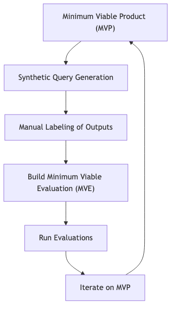

# Evaluation-Driven Development (EDD) Framework

> *"Evaluation is the compass that guides AI product development from vague ideas to measurable outcomes."* - Hugo, LLM Software Engineering Advisor

---

## Core Principles of EDD

Evaluation-Driven Development (EDD) shifts the focus from *building first* to *evaluating first*. This framework ensures AI systems are robust, aligned with business goals, and ready for production before a single user interacts with them.

Key principles:
- **Synthetic data** as the foundation for pre-launch testing
- **Evaluation harnesses** to automate and track improvements
- **Business-aligned metrics** that tie technical performance to outcomes

[Eval Maturity Ladder](../foundations/eval-maturity-ladder.md) emphasizes the importance of structured evaluation. EDD expands on this by providing a concrete process for teams to implement it.

---

## The Pre-Launch Data Flywheel

**Step-by-Step Process**:
1. **MVP**: Develop a basic version of your AI system (e.g., RAG chatbot)
2. **Synthetic Queries**: Generate test queries based on user personas and scenarios
3. **Manual Labeling**: Evaluate MVP outputs manually (20–50 examples recommended)
4. **Build MVE**: Create an evaluation harness using labeled data
5. **Evaluate & Improve**: Use MVE to test changes and measure impact

This loop ensures continuous improvement before user data is available.

---

## Why Traditional Testing Fails for AI

**Key Differences**:
- **Inputs**: AI systems handle unbounded, natural language queries
- **Outputs**: Probabilistic and context-dependent
- **Error Signals**: No stack traces - only confident-sounding but potentially incorrect answers

EDD addresses these challenges by focusing on **business-aligned metrics** and **synthetic data validation**.

---

## Building the Evaluation Harness

An effective evaluation harness should track four key areas:

### 1. **User/Business Metrics**
- Does the app achieve its goal? (e.g., "Did the agent find the correct documentation link?")

### 2. **Accuracy**
- Is the output correct? (Measured via string matching, LLM judges, or human labels)

### 3. **Cost**
- How much does each call or session cost? (API usage, compute resources)

### 4. **Latency**
- How long does it take to get a response? (Critical for real-time systems)

[Mirage of Generic Metrics](../metrics/mirage-of-generic-metrics.md) explains why generic metrics like BLEU/ROUGE are insufficient. EDD emphasizes task-specific, business-aligned metrics.

---

## From "Vibes" to Structured Evaluation

Initial evaluation often relies on **subjective "vibes"** - e.g., "That answer feels wrong." While useful for intuition, these are inconsistent and untrackable.

EDD replaces this with:
- **Objective metrics** (e.g., precision, recall, latency)
- **Historical baselines** for tracking improvements
- **Standardized evaluation** across teams and over time

A minimal evaluation harness can be built with just 20–50 labeled examples, as shown in [build an ai evals dataset from scratch](../building-evals/build-dataset-from-scratch.md).

---

## EDD in Practice: Case Study

**Example**: Building a recruitment email outreach system
- **Business Goal**: Increase hiring efficiency
- **Technical Metrics**: LLM call correctness (precision, recall)
- **Business Metrics**: Candidate conversion rate, time-to-hire

EDD ensures both technical and business metrics are tracked, enabling data-driven decisions.

---

## Resources

- [Judge Validation Protocol](../llm-judges/validation-protocol.md) for calibrating LLM judges
- [Error Analysis](../error-analysis/overview.md) to identify failure modes
- [Integrating Evals](integrating-evals.md) for production readiness

---
