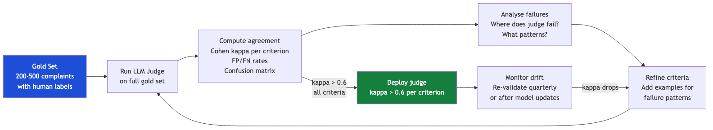

# Judge Validation Protocol

A judge that has not been validated against human labels is not a judge — it is a guess at scale.

> **Source:** Eugene Yan — [Evaluating the Effectiveness of LLM Evaluators](https://eugeneyan.com/writing/llm-evaluators/) *(site blocked at build time)*

---

## The calibration pipeline


---

## Cohen kappa interpretation

| Kappa value | Interpretation | Action |
|---|---|---|
| < 0.0 | Less than chance agreement | Criteria fundamentally broken — rewrite |
| 0.0 – 0.4 | Poor agreement | Criteria too vague — add examples, be more specific |
| 0.4 – 0.6 | Moderate agreement | Usable with caution; analyse disagreements |
| 0.6 – 0.8 | Good agreement | **Deploy threshold** — judge is reliable |
| 0.8 – 1.0 | Very good / near-perfect | Ideal; continue monitoring |

---

## Computing kappa in Python

```python
from sklearn.metrics import cohen_kappa_score

def validate_judge(judge_verdicts: list, human_labels: list, criterion_name: str) -> dict:
    """
    Validate LLM judge against human labels for a single criterion.
    Both lists contain 'YES'/'NO' strings.
    Returns kappa, accuracy, false positive rate, false negative rate.
    """
    # Convert to binary
    j = [1 if v == "YES" else 0 for v in judge_verdicts]
    h = [1 if v == "YES" else 0 for v in human_labels]

    kappa = cohen_kappa_score(h, j)
    accuracy = sum(a == b for a, b in zip(j, h)) / len(h)
    fp = sum(1 for a, b in zip(j, h) if a == 1 and b == 0) / max(sum(1 for b in h if b == 0), 1)
    fn = sum(1 for a, b in zip(j, h) if a == 0 and b == 1) / max(sum(1 for b in h if b == 1), 1)

    return {
        "criterion": criterion_name,
        "kappa": round(kappa, 3),
        "accuracy": round(accuracy, 3),
        "false_positive_rate": round(fp, 3),
        "false_negative_rate": round(fn, 3),
        "deployable": kappa >= 0.6
    }

# Example usage
results = validate_judge(
    judge_verdicts=["YES", "NO", "YES", "YES", "NO"],
    human_labels=["YES", "NO", "NO", "YES", "NO"],
    criterion_name="C1_taxonomy_compliance"
)
print(results)
# {'criterion': 'C1_taxonomy_compliance', 'kappa': 0.667, 'accuracy': 0.8,
#  'false_positive_rate': 0.5, 'false_negative_rate': 0.0, 'deployable': True}
```

---

## Quarterly re-validation checklist

- [ ] Run judge on the same gold set as last quarter
- [ ] Compute kappa per criterion and compare to previous quarter
- [ ] If kappa drops > 0.1 on any criterion: flag for investigation
- [ ] Check if LLM provider updated the model — this is the most common cause of drift
- [ ] Review any new complaint types added since last validation
- [ ] Update gold set with cases from the last quarter's error analysis sessions

---

## What to do when the judge fails validation

1. **Identify which criterion failed** — is it a single criterion or all of them?
2. **Pull 20 disagreement cases** — read them manually
3. **Classify failure pattern** — is the judge over-calling? Under-calling? Confused on a specific sub-type?
4. **Add targeted examples** — add 3–5 examples that address the failure pattern
5. **Re-validate** — does kappa recover?
6. **If kappa stays low:** consider rewriting the criterion entirely or splitting it into two simpler criteria

---

*Back: [LLM as Judge Complete Guide](llm-as-judge-complete-guide.md)*
