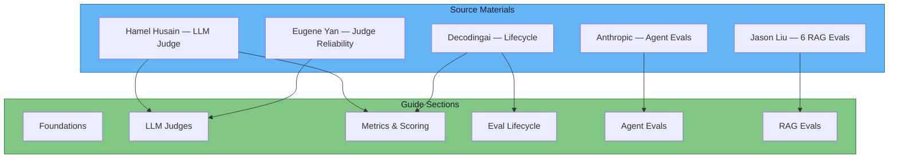

# References

All source materials that inform this guide, organized by category with key contributions noted.

---

## Primary References

### Blog Posts & Articles

| # | Author | Title | Key Contribution |
|---|---|---|---|
| 1 | Hamel Husain | [Your AI Product Needs Evals](https://hamel.dev/blog/posts/llm-judge/) | Criteria-based judge design; binary scoring; failure modes; validation against human labels |
| 2 | Decodingai.com | [Integrating AI Evals into Your AI App](https://www.decodingai.com/p/integrating-ai-evals-into-your-ai-app) | Four-phase eval lifecycle: design, development, pre-production, production |
| 3 | Anthropic | [Demystifying Evals for AI Agents](https://www.anthropic.com/engineering/demystifying-evals-for-ai-agents) | Unit evals, trajectory evals, final-state evals for agentic systems |
| 4 | Jason Liu | [There Are Only 6 RAG Evals](https://jxnl.co/writing/2025/05/19/there-are-only-6-rag-evals/) | The 6-metric RAG framework: context precision, recall, faithfulness, relevance, correctness, completeness |
| 5 | Decodingai.com | [Stop Launching AI Apps Without This Framework](https://www.decodingai.com/p/stop-launching-ai-apps-without-this) | Evaluation-Driven Development (EDD) as a discipline |
| 6 | Decodingai.com | [The 5-Star Lie](https://www.decodingai.com/p/the-5-star-lie-you-are-doing-ai-evals) | Binary evals yield kappa 0.6–0.9; Likert scales yield kappa 0.2–0.4 |
| 7 | Decodingai.com | [The Mirage of Generic AI Metrics](https://www.decodingai.com/p/the-mirage-of-generic-ai-metrics) | Generic metrics (BLEU, ROUGE) do not predict success on actual tasks |
| 10 | Eugene Yan | [Evaluating the Effectiveness of LLM Evaluators](https://eugeneyan.com/writing/llm-evaluators/) | Empirical study of judge reliability; positional bias, self-preference, verbosity bias |

### Video & Podcast

| # | Author | Title | Key Contribution |
|---|---|---|---|
| 9 | Hamel Husain | [Error Analysis (YouTube)](https://www.youtube.com/watch?v=e2i6JbU2R-s) | Practical walkthrough of error analysis; the discipline of reading data manually |
| 11 | Hamel Husain | [LLM Judges Aren't the Shortcut You Think (YouTube)](https://www.youtube.com/watch?v=sEMYSSS6Ims) | Practical judge design; common pitfalls; calibration walkthrough |
| — | Lenny's Podcast | [Why AI evals are the hottest new skill for product builders](https://www.youtube.com/watch?v=BsWxPI9UM4c) | End-to-end overview of eval programme design for product teams |

### Academic & Books

| # | Author | Title | Key Contribution |
|---|---|---|---|
| — | Reganti, A. N. & Badam, K. (2025) | [Evals Are NOT All You Need](https://www.oreilly.com/radar/evals-are-not-all-you-need/) | O'Reilly. Evaluation alone does not produce quality — process around it does |
| — | Habib, R. (2024) | [Why Your AI Product Needs Evals with Hamel Husain](https://humanloop.com/blog/why-your-product-needs-evals) | Humanloop Blog. Integration of evals into product development workflow |

---

## Tooling Documentation

| Platform | Resource | Coverage in This Guide |
|---|---|---|
| Databricks / MLflow | [Building MLflow Evaluation Datasets](https://docs.databricks.com/) | [MLflow Evaluation Datasets](tools/mlflow-evaluation-datasets.md) |
| Databricks / MLflow | [MLflow Tracing — GenAI Observability](https://docs.databricks.com/) | [MLflow Tracing & Observability](tools/mlflow-tracing-observability.md) |
| Databricks / MLflow | [Evaluate and Monitor AI Agents](https://docs.databricks.com/) | [Evaluate & Monitor AI Agents](tools/evaluate-monitor-agents.md) |

---

## How References Map to Guide Sections

---

## Citation Format

When referencing material from this guide, use:

> Girard, A. (2026). *AI Evaluators: A Practitioner's Guide*. Retrieved from [site URL].

For individual articles within the guide, append the section path:

> Girard, A. (2026). "LLM-as-Judge: Complete Guide." In *AI Evaluators*. Retrieved from [site URL]/llm-judges/llm-as-judge-complete-guide/.
