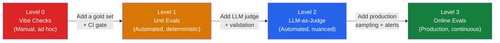

# Eval Maturity Ladder

Understanding where your team sits determines what to build next. Most teams underestimate how much value is left at lower levels before reaching for LLM judges.

---

## The four levels

---

## Level descriptions

### Level 0: Vibe Checks
Manual inspection of a handful of examples before each release. No systematic coverage. Failure discovery is random and reactive.

**Signs you're here:** "We look at a few outputs and it seems fine." "We test it ourselves before shipping."

**Cost of staying here:** You will ship regressions. The complaint classifier will silently miss the Underquoting theme on 20% of cases and no one will know until a regulator asks.

---

### Level 1: Unit Evals
A curated set of known input–output pairs. Automated checks on every code change. Catches regressions but limited to cases you anticipated.

**How to get here:**
1. Collect 50–200 representative examples with verified correct answers
2. Write automated assertions (exact match, set match, regex checks)
3. Run on every pull request; block merges on regression

**For UC1:** A set of 200 complaints with agreed theme labels. Automated check that every output includes only valid taxonomy terms and no hallucinated themes.

---

### Level 2: LLM-as-Judge
A second LLM evaluates outputs against criteria you define. Scales to thousands of examples. Handles nuanced quality dimensions that unit evals cannot capture.

**Prerequisites:**
- A validated gold set to calibrate the judge against
- Criteria specific to your task (not generic "is this good?")
- Cohen kappa > 0.6 between judge and human labels before trusting it

**For UC1:** The judge evaluates whether each predicted theme is justified by the complaint text, and whether all applicable themes have been captured.

---

### Level 3: Online Evals + Observability
Production traffic is sampled and evaluated continuously. Drift is detected automatically. Feedback loops from production feed into the eval suite.

**What this gives you:**
- Early warning when model updates change output quality
- Data on real user queries that expose gaps in your offline test set
- Continuous calibration of your gold set as complaint types evolve

---

## Where most teams get stuck

| Failure pattern | What it looks like | Fix |
|---|---|---|
| Jumping to L2 too early | LLM judge built before gold set exists; no way to validate it | Build gold set first |
| L1 coverage gap | Unit evals pass but LLM judge reveals systematic failures | Expand gold set to cover failure clusters |
| L2 trust without validation | LLM judge used at scale; never checked against humans | Compute kappa quarterly |
| Stuck at L2 | No production monitoring; drift undetected | Add logging + sampling |

---

*Back: [Why Evals Matter](Why-Evals-Matter) | Next section: [Eval Taxonomy](../01-Foundations/Eval-Types-Overview)*
