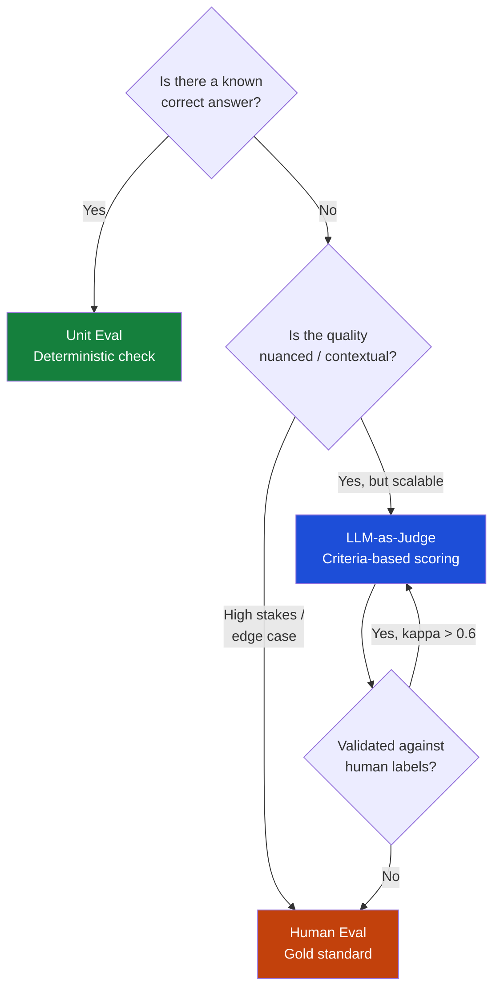
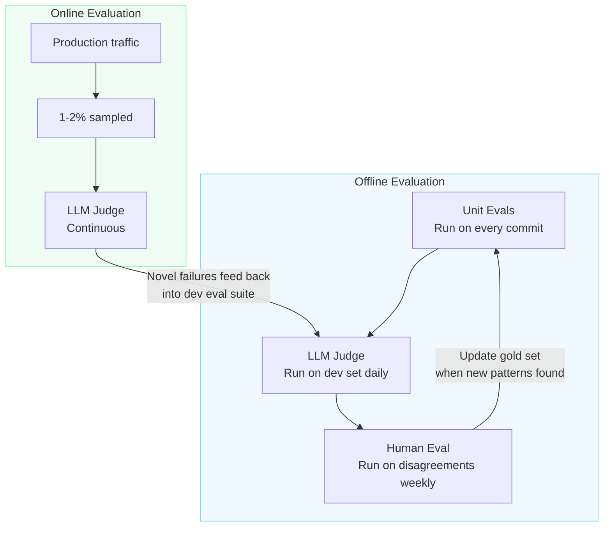

# Eval Types Overview

Three fundamentally different types of evaluation exist, each serving a different purpose. The key mistake most teams make is reaching for the most expensive type (LLM judge) when the cheapest (unit eval) would serve.

---

## Decision tree: which eval type to use?

---

## Comparison at a glance

| Dimension | Unit Eval | LLM-as-Judge | Human Eval |
|---|---|---|---|
| Speed | Milliseconds | Seconds | Hours–days |
| Cost | Near zero | Low ($0.001–0.01/example) | High |
| Scale | Unlimited | Thousands/day | Hundreds/month |
| Coverage | Known cases only | Generalises to novel cases | Any case |
| Reliability | Perfect (deterministic) | Requires validation (kappa) | Ground truth |
| Actionability | Immediate | Depends on criteria quality | Slow feedback loop |
| Best used for | Regressions, format checks | Quality at scale, nuanced dims | Gold set, calibration |

---

## Using all three together

The correct architecture is not a choice between these three — it is a **layered system** where each type serves a different role:

---

## Applied to our use cases

### UC1 — Complaint Classifier
- **Unit evals:** 200 complaints with verified theme labels; exact match + taxonomy compliance check
- **LLM judge:** Criteria-based judge for multi-label coverage and theme justification; runs nightly on dev set
- **Human eval:** Domain expert reviews 50 judge disagreements per month; updates gold set

### UC2 — RAG Chatbot
- **Unit evals:** Known query–answer pairs (e.g., "How many complaints 2025-26?" → exact count)
- **LLM judge:** Faithfulness check (are all claims grounded in retrieved context?); relevance check
- **Human eval:** Regulatory staff review 20 sampled responses per week

---

*Next: [Unit Evals](Unit-Evals)*
