# Unit Evals

Unit evals are the foundation of any evaluation system. They are deterministic, fast, and free. Most teams underinvest in them.

> *"Most teams jump to LLM judges too quickly. Build your unit evals first. They catch 60–70% of failures at 1% of the cost."* — Hamel Husain

---

## What makes a good unit eval?

A unit eval has three properties:
1. **Known correct answer** — verified by a domain expert, not assumed
2. **Automated assertion** — runs in CI/CD without human intervention
3. **Failure is actionable** — when it fails, you know exactly what broke and why

---

## Unit eval types for complaint classification (UC1)


---

## Example unit eval implementations (Python)

```python
import json
from typing import List

VALID_THEMES = {
    "Unsatisfactory behaviour by strata manager/agent",
    "Agent failure to act honestly / fairly",
    "Underquoting",
    "Advertising at misleading prices",
    "Misleading advertising",
    "Failure to disclose material facts",
    "Breach of fiduciary duty",
    "Failure to maintain trust account",
}

def eval_taxonomy_compliance(predicted: List[str]) -> bool:
    """C1: No invented themes in output."""
    return all(t in VALID_THEMES for t in predicted)

def eval_set_containment(predicted: List[str], required: List[str]) -> bool:
    """C2: All required themes are present."""
    return all(t in predicted for t in required)

def eval_format(raw_output: str) -> bool:
    """C3: Output is valid JSON with 'themes' key."""
    try:
        parsed = json.loads(raw_output)
        return "themes" in parsed and isinstance(parsed["themes"], list)
    except (json.JSONDecodeError, KeyError):
        return False

def run_unit_evals(gold_set: List[dict], predictions: List[dict]) -> dict:
    """Run all unit evals over a gold set and return summary."""
    results = {"taxonomy": [], "coverage": [], "format": []}
    for gold, pred in zip(gold_set, predictions):
        results["taxonomy"].append(eval_taxonomy_compliance(pred["themes"]))
        results["coverage"].append(eval_set_containment(pred["themes"], gold["themes"]))
        results["format"].append(eval_format(pred["raw_output"]))
    return {k: sum(v) / len(v) for k, v in results.items()}
```

---

## Unit evals for RAG chatbot (UC2)

| Eval | Assertion | Example |
|---|---|---|
| Count exact match | `predicted_count == ground_truth_count` | "147 complaints" == DB query result |
| Date range parsed | Response contains explicit date range | Output mentions "2025-2026" |
| Region filter applied | Response references queried region | "Western Sydney" appears in answer |
| No hallucination marker | Response does not claim certainty without retrieval | Fails if "definitely" without citation |
| Completeness | All required dimensions present | Both "nature" and "volume" in multi-part answer |

---

## Building a good gold set

A gold set is only as good as the process used to build it.

1. **Start with 50 examples** before scaling — validate the process first
2. **Use 2+ domain experts** per example — resolve disagreements explicitly
3. **Document the reasoning** for borderline cases — this becomes your criteria specification
4. **Stratify by case type** — don't let common cases dominate; include edge cases proportionally
5. **Treat it as a living document** — add to it every time error analysis reveals a new failure cluster

---

*Back: [Eval Types Overview](Eval-Types-Overview) | Next: [LLM-as-Judge](LLM-as-Judge)*
