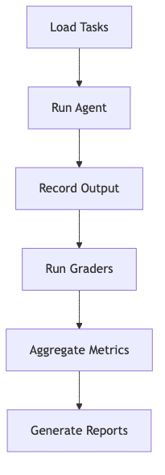

# Using LLM-as-a-Judge For Evaluation: A Complete Guide

> *"The solution is Critique Shadowing: aligning evaluation with domain expertise to avoid drowning in unactionable metrics."* — Hamel Husain

---

## The Problem: AI Teams Are Drowning in Data

Teams often build AI systems without a clear evaluation strategy, leading to:

- **Overloaded dashboards** with arbitrary 1–5 scales that lack calibration
- **Unvalidated metrics** that don't reflect real-world user needs
- **Lack of domain alignment**, resulting in systems that fail to meet business goals

The result? Teams waste time on metrics that don't matter, while critical failure modes go undetected. [Build an AI Evals Dataset from Scratch](../02-Building-Evals/build-an-ai-evals-dataset-from-scratch.md) explains how to avoid this trap.

---

## Step 1: Find The Principal Domain Expert

Identify the **Principal Domain Expert** (PDE) — the individual whose judgment defines success for your AI product. This could be:

- A **psychologist** for a mental health chatbot
- A **customer service director** for a support agent
- A **curriculum developer** for an educational tool

### Why PDEs Matter

- They define what "good" looks like in your domain
- They uncover unspoken user expectations
- They ensure evaluations align with business outcomes

> **Tip**: Involve PDEs early and keep their input focused. Use [How to Design Evaluators That Catch What Actually Breaks](LLM-as-Judge-Complete-Guide.md) to streamline their feedback.

---

## Step 2: Create a Dataset

With your PDE on board, build a dataset that captures real-world failure modes. Focus on **diversity** and **relevance**.

### Key Dimensions for Structuring Your Dataset

| **Feature** | **Scenario** | **Persona** |
|-------------|--------------|-------------|
| Email summarization | Multiple matches found | Non-native speaker |
| Meeting scheduling | Ambiguous request | Busy professional |
| Order tracking | No matches found | Elderly user |

### Example Dataset Entry

```json
{
  "input": "Where is my order #123?",
  "expected_output": "Order #123 is being shipped and will arrive by Friday.",
  "actual_output": "We found three orders with similar numbers. Could you clarify?",
  "error_type": "Ambiguous response",
  "severity": "Medium"
}
```

> **Tip**: Use [Unit evals](../01-Foundations/Unit-Evals.md) to automate synthetic data generation for edge cases.

---

## Step 3: Implement Critique Shadowing

**Critique Shadowing** is the process of aligning LLM judges with human expertise:

1. **Train judges** using labeled data from your PDE
2. **Validate judges** by comparing their scores to human labels
3. **Iterate** based on error analysis and feedback

### Example Judge Prompt

> *You are a customer service expert. Score the agent's response on a binary scale: 1 if it resolves the user's issue, 0 otherwise.*

---

## Step 4: Build an Evaluation Harness

Automate testing with an **evaluation harness** that:

- Loads tasks from your dataset
- Runs agents in parallel
- Executes custom evaluators
- Aggregates results and generates reports


> **Tip**: Use platforms like [Validation Protocol](Validation-Protocol.md) or Opik for scalable implementation.

---

## Avoiding Common Pitfalls

| Mistake | Solution |
|--------|----------|
| Too many metrics | Focus on 2–3 key business outcomes |
| Uncalibrated scales | Use binary scoring (pass/fail) |
| Ignoring PDEs | Involve them in every stage |
| Unvalidated metrics | Align with [Binary vs Likert](../04-Metrics-and-Scoring/Binary-vs-Likert.md) principles |

---

## Conclusion

LLM-as-judge evaluations are powerful — but only when aligned with domain expertise and business goals. By following Critique Shadowing and building a dataset-driven evaluation system, teams can avoid the trap of "vibe checks" and focus on what truly matters. Start small, iterate, and let the data guide you.
