# Behind the Scenes of AI Observability in Production

A deep dive into the challenges and solutions for implementing AI observability in real-world agent systems, based on 6 months of hands-on experience with a production AI companion.

---

## Lessons from 6 Months of Evals on a Production AI Companion

This article is based on insights from Alejandro Aboy, Senior Data Engineer at Workpath, who led the implementation of AI observability for the *Workpath AI Companion* — an agent capable of calling 50+ tools, performing RAG searches, and managing workflows.

---

## Problems With AI Observability

### Falling for Classic Metrics or Trying to Define What’s “Good” or “Bad”

Tools like Opik or Langfuse provide default metrics such as *Hallucination*, *AnswerRelevance*, and *ContextRecall*. However, relying on these without aligning them to your specific use case can lead to misleading conclusions.

> **Example**: To evaluate hallucination in documentation links, a binary metric was used: *Check if `search_knowledge` tool was called and verify if the URL in the output matches the tool output the agent used.*

---

### Not Going Through Manual Annotations

Automating all evaluations with LLM-as-judge can miss nuanced issues. Manual annotations are critical for uncovering edge cases like:

- Agents suggesting actions outside their scope
- Misinterpreting user intent
- Failing to handle ambiguous queries

> **Solution**: Use MCP (Model Change Protocol) servers to cluster manual feedback and generate actionable insights.

---

### Not Treating Your AI Agents as a Data Product

Treating agents as isolated systems misses opportunities to extract value from their interactions. Key practices include:

- Creating product analytics use cases based on agent conversations
- Using real production data to identify improvement opportunities
- Mapping agent behavior to JIRA tickets or feature roadmaps

---

## Implementing AI Observability

### Opik Overview

Opik's MCP server enables structured evaluation by:

1. **Figuring Out Evaluation Criteria**  
   Define success metrics aligned with business goals (e.g., accuracy, safety, user satisfaction).

2. **Refining Evaluation Criteria**  
   Iterate based on manual annotations and feedback from cross-functional teams.

3. **Running Annotation Sessions**  
   Use human annotators to label agent outputs, ensuring consistency and depth.

4. **Making Sense Of Annotated Feedback**  
   Cluster feedback using MCP servers to identify patterns and prioritize improvements.

---

## Backstory of This Framework

The framework evolved from addressing real-world issues in the Workpath AI Companion, such as:

- Agents hallucinating documentation links
- Incorrect tool calls based on misinterpreted user data
- Suggesting out-of-scope actions

> **Key Takeaway**: Observability is not just about metrics — it's about creating a feedback loop that drives continuous improvement.

---

## Recommended Reading

- [Binary vs Likert](../04-Metrics-and-Scoring/Binary-vs-Likert.md) — Why binary metrics outperform Likert scales
- [The Mirage of Generic AI Metrics](../04-Metrics-and-Scoring/Mirage-of-Generic-Metrics.md) — How to build task-specific evaluation criteria
- [LLM-as-Judge: Complete Guide](../03-LLM-Judges/LLM-as-Judge-Complete-Guide.md) — Hamel Husain's Critique Shadowing method
