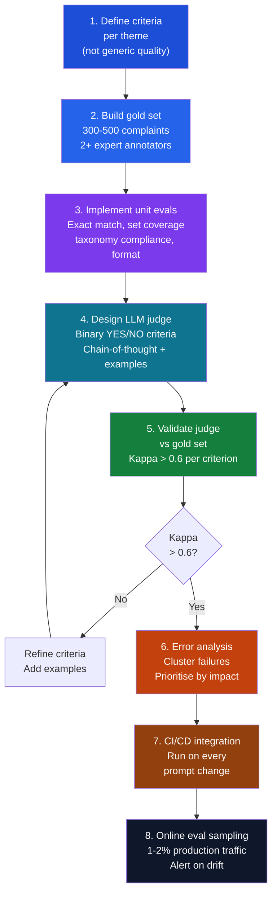

# UC1: Eval Design — Step by Step

The 8-step process for building a production-grade eval suite for complaint theme classification.

---

## The 8-step process



---

## Step 1: Define criteria per theme

Before writing any code, write plain-language criteria for each taxonomy theme. These criteria will become:
- The specifications your prompt must satisfy
- The criteria in your LLM judge prompt
- The acceptance tests in your CI/CD pipeline

**Template for each theme:**

```
Theme: [Theme name]
Definition: [Plain language definition]
Applies when: [Inclusion criteria]
Does NOT apply when: [Exclusion criteria]
Boundary with [adjacent theme]: [How to distinguish]
Positive examples: [2-3 complaint excerpts that clearly apply]
Negative examples: [2-3 complaint excerpts that do not apply]
Edge cases: [Known ambiguous situations + resolution]
```

---

## Step 2: Build the gold set

- **Target size:** 300–500 complaints for initial gold set
- **Annotation process:** 2 domain experts label independently; resolve disagreements in a joint session
- **Documentation:** Record the reasoning for every disagreement resolution — this becomes your criteria refinement
- **Stratification:** Ensure representation of each theme, multi-theme combinations, and edge cases
- **Hold out 20%** as a test set unseen during prompt development

---

## Step 3: Unit eval implementation

```python
# Core unit evals for UC1
VALID_THEMES = {
    "Unsatisfactory behaviour by strata manager/agent",
    "Agent failure to act honestly / fairly",
    "Underquoting",
    "Advertising at misleading prices",
    "Misleading advertising",
    "Failure to disclose material facts",
    "Breach of fiduciary duty",
    "Failure to maintain trust account",
}

def assert_taxonomy_compliance(predicted_themes: list) -> bool:
    return all(t in VALID_THEMES for t in predicted_themes)

def assert_theme_coverage(predicted_themes: list, required_themes: list) -> bool:
    return set(required_themes).issubset(set(predicted_themes))

def assert_no_hallucination(predicted_themes: list) -> bool:
    # Stricter than taxonomy compliance — also checks for theme fragments / partial matches
    return all(any(t == v for v in VALID_THEMES) for t in predicted_themes)
```

---

## Step 7: CI/CD gate

Every prompt change triggers the full eval suite. Merges are blocked if:
- Taxonomy compliance rate drops below 99%
- F1 score on any individual theme drops by more than 2 percentage points
- Multi-label coverage rate drops below 90%
- Cohen kappa of the LLM judge drops below 0.6

```yaml
# Example GitHub Actions / Azure Pipelines step
- name: Run eval suite
  run: |
    python run_evals.py \
      --gold-set data/gold_set.json \
      --predictions outputs/predictions.json \
      --thresholds config/eval_thresholds.yaml
  env:
    FAIL_ON_REGRESSION: "true"
```

---

## Step 8: Online eval sampling

```python
import random

def should_eval_online(complaint_id: str, sample_rate: float = 0.02) -> bool:
    """Sample ~2% of production complaints for online eval."""
    return random.random() < sample_rate

def online_eval_pipeline(complaint: dict, predicted_themes: list) -> dict:
    """Run LLM judge on a sampled production complaint and log results."""
    if not should_eval_online(complaint["id"]):
        return None
    score = run_llm_judge(complaint["text"], predicted_themes)
    log_eval_result(complaint["id"], score)
    check_drift_alert(score)
    return score
```

---

*Back: [The Taxonomy](The-Taxonomy) | Next: [Metrics](Metrics)*
