# The 6 RAG Evals

> *"There are only 6 RAG evals."* — Jason Liu, [jxnl.co](https://jxnl.co/writing/2025/05/19/there-are-only-6-rag-evals/) *(site blocked at build time)*

Teams that add more metrics without covering these six are measuring noise. Teams that skip any of these six have blind spots that produce production failures.

---

## The 6 evals mapped to the RAG pipeline

---

## Eval 1: Context Precision (Retrieval)

**Formula:** `Precision = Relevant retrieved / Total retrieved` | **Target:** > 85%

Chatbot: Are retrieved records from Western Sydney, or cluttered with other regions?

**Fix when failing:** Add explicit region metadata filters; improve chunking strategy.

---

## Eval 2: Context Recall (Retrieval)

**Formula:** `Recall = Relevant retrieved / Total relevant in DB` | **Target:** > 90%

Chatbot: Did retrieval find ALL Western Sydney 2025-26 complaints, or are some missing?

**Fix when failing:** Re-index; increase top-k; add keyword fallback for geographic terms.

---

## Eval 3: Answer Faithfulness (Generation) — CRITICAL

**Formula:** `Faithfulness = Supported claims / Total claims` | **Target:** 100%

Chatbot: Did the bot fabricate a count not present in retrieved records?

**Fix when failing:** Add to system prompt: *"Every factual claim must be explicitly in the retrieved records. If not, say you don't know."*

---

## Eval 4: Answer Relevance (Generation)

**Measurement:** Cosine similarity of re-generated questions vs original | **Target:** > 0.85

Chatbot: Did the answer stay on Western Sydney or drift to state-wide data?

---

## Eval 5: Answer Correctness (Generation) — CRITICAL

**Measurement:** Exact match (counts); semantic F1 (descriptions) | **Target:** Exact for counts

Chatbot: Does "147" match the actual database query result for the same parameters?

---

## Eval 6: Answer Completeness (Generation)

**Formula:** `Completeness = Covered aspects / Required aspects` | **Target:** 1.0 for multi-part

Chatbot: If user asked "nature AND volume", did the answer address both?

---

## Priority order

| Priority | Eval | Why |
|---|---|---|
| CRITICAL | Faithfulness | Hallucination in regulatory context is catastrophic |
| CRITICAL | Correctness | Wrong facts destroy trust and decisions |
| HIGH | Context Recall | Missing records = missing data |
| HIGH | Context Precision | Noisy retrieval degrades all downstream quality |
| MEDIUM | Relevance | Off-topic answers frustrate users |
| MEDIUM | Completeness | Fix after all others are stable |

---

*Back: [RAG Architecture](RAG-Architecture) | Next: [Building Test Set](Building-Test-Set)*
