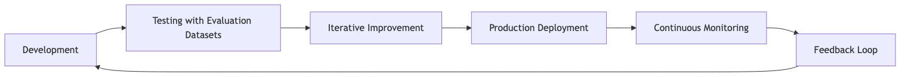

# Evaluate and monitor AI agents

MLflow provides comprehensive agent evaluation and LLM evaluation capabilities to help you measure, improve, and maintain the quality of your AI applications. MLflow supports the entire development lifecycle from testing through production monitoring for LLMs, agents, RAG systems, or other GenAI applications.

Evaluating AI agents and LLMs is more complex than traditional ML model evaluation. These applications involve multiple components, multi-turn conversations, and nuanced quality criteria. Both qualitative and quantitative metrics require specialized evaluation approaches to accurately assess performance.

The evaluation and monitoring component of MLflow 3 is designed to help you iteratively optimize the quality of your GenAI app. Evaluation and monitoring build upon [MLflow Tracing](https://learn.microsoft.com/en-us/azure/databricks/mlflow3/genai/tracing/), which provides real-time trace logging in the development, testing, and production phases. Traces can be [evaluated during development](https://learn.microsoft.com/en-us/azure/databricks/mlflow3/genai/eval-monitor/concepts/eval-harness) using built-in or custom [LLM judges and scorers](https://learn.microsoft.com/en-us/azure/databricks/mlflow3/genai/eval-monitor/concepts/scorers), and [production monitoring](https://learn.microsoft.com/en-us/azure/databricks/mlflow3/genai/eval-monitor/production-monitoring) can reuse the same judges and scorers, ensuring consistent evaluation throughout the application lifecycle. Domain experts can provide feedback using an integrated [Review App](https://learn.microsoft.com/en-us/azure/databricks/mlflow3/genai/human-feedback/expert-feedback/live-app-testing) for collecting human feedback, producing evaluation data for further iteration.

## Evaluation and Monitoring Workflow

## Key Features

| Feature | Description |
| --- | --- |
| [10-minute demo: Evaluate a GenAI app](https://learn.microsoft.com/en-us/azure/databricks/mlflow3/genai/getting-started/eval) | Run a quick demo notebook that introduces MLflow Evaluation using a simple GenAI application. |
| [Tutorial: Evaluate and improve a GenAI application](https://learn.microsoft.com/en-us/azure/databricks/mlflow3/genai/eval-monitor/evaluate-app) | Step through a tutorial of the complete evaluation workflow, using a simulated RAG application. Use evaluation datasets and LLM judges to evaluate quality, identify issues, and iteratively improve your app. |
| [Scorers and LLM judges](https://learn.microsoft.com/en-us/azure/databricks/mlflow3/genai/eval-monitor/concepts/scorers) | Define quality metrics for your app using [built-in LLM judges](https://learn.microsoft.com/en-us/azure/databricks/mlflow3/genai/eval-monitor/concepts/scorers#built-in-llm-judges), [custom LLM judges](https://learn.microsoft.com/en-us/azure/databricks/mlflow3/genai/eval-monitor/custom-judge/), and [custom scorers](https://learn.microsoft.com/en-us/azure/databricks/mlflow3/genai/eval-monitor/custom-scorers). Use the same metrics for both development and production. |
| [Evaluate during development](https://learn.microsoft.com/en-us/azure/databricks/mlflow3/genai/eval-monitor/concepts/eval-harness) | Test your GenAI application on evaluation datasets, using scorers and LLM judges. Compare app versions, track improvements, and share results. |
| [Evaluate conversations](https://learn.microsoft.com/en-us/azure/databricks/mlflow3/genai/eval-monitor/evaluate-conversations) | Assess multi-turn conversation quality with specialized scorers for conversation completeness, user frustration, and dialogue coherence. |
| [Conversation simulation](https://learn.microsoft.com/en-us/azure/databricks/mlflow3/genai/eval-monitor/conversation-simulation) | Generate synthetic multi-turn conversations to test conversational AI agents with diverse scenarios and user behaviors. |
| [Monitor apps in production](https://learn.microsoft.com/en-us/azure/databricks/mlflow3/genai/eval-monitor/production-monitoring) ([Beta](https://learn.microsoft.com/en-us/azure/databricks/release-notes/release-types)) | Automatically run scorers and LLM judges on your production GenAI application traces to continuously monitor quality. |
| [Gather human feedback](https://learn.microsoft.com/en-us/azure/databricks/mlflow3/genai/human-feedback/) | Use the Review App to collect expert feedback and build evaluation datasets. |
| [Genie Code for agent observability and evaluation](https://learn.microsoft.com/en-us/azure/databricks/mlflow3/genai/getting-started/genie-code) | Use natural language to review assessment scores, inspect evaluation datasets, check scheduled scorers, and get help setting up `mlflow.genai.evaluate()` with the right scorers. |

## Additional Resources

- [Tutorial: Evaluate and improve a GenAI application](tutorial-evaluate-and-improve-a-genai-application.md)
- [Building MLflow Evaluation Datasets](building-mlflow-evaluation-datasets.md)

### Training

- [Monitor your generative AI application - Training](https://learn.microsoft.com/en-us/training/modules/monitor-generative-ai-app/?source=recommendations)

### Certification

- [Microsoft Certified: Azure Data Scientist Associate - Certifications](https://learn.microsoft.com/en-us/credentials/certifications/azure-data-scientist/?source=recommendations)
