# MLflow Tracing - GenAI observability

MLflow Tracing provides **end-to-end observability** for GenAI applications, including complex agent-based systems. It records inputs, outputs, intermediate steps, and metadata to give you a complete picture of how your app behaves, enabling debugging, performance monitoring, and quality evaluation.

## Key Features

MLflow Tracing supports:

- **Debugging and understanding** your application through detailed trace logs
- **Performance monitoring** and cost optimization by tracking latency, token usage, and resource consumption
- **Production monitoring** to ensure consistent quality and compliance
- **Evaluation and enhancement** of application quality using trace data
- **Auditability and compliance** through comprehensive logging
- **Integration** with popular third-party frameworks
- **Natural language analysis** via Genie Code for trace exploration and error debugging

## Observability Workflow

## Next Steps

- [10-minute tracing demo](tutorial-evaluate-and-improve-a-genai-application.md) - Get started with tracing in Databricks
- [Instrument your app](evaluate-and-monitor-ai-agents.md) - Choose between automatic and manual tracing approaches
- [Genie Code for agent observability and evaluation](evaluate-and-monitor-ai-agents.md) - Analyze traces, debug errors, and explore evaluation data using natural language

## Additional Resources

### Training
- [Monitor your generative AI application - Training](https://learn.microsoft.com/en-us/training/modules/monitor-generative-ai-app/?source=recommendations) - Learn to track key metrics like latency and token usage for cost-effective deployment decisions

### Certification
- [Microsoft Certified: Azure Data Scientist Associate - Certifications](https://learn.microsoft.com/en-us/credentials/certifications/azure-data-scientist/?source=recommendations) - Manage data ingestion, model training, and ML solution monitoring with Python, Azure Machine Learning, and MLflow
