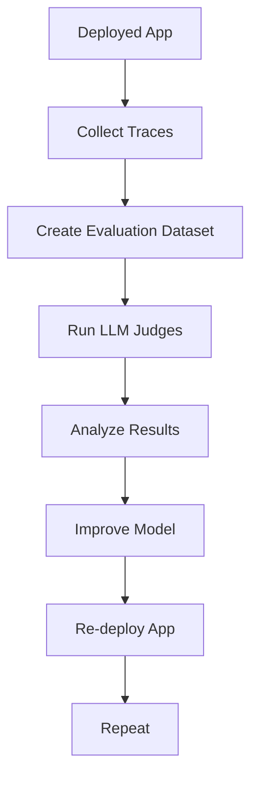

# Tutorial: Evaluate and improve a GenAI application

This guide walks through evaluating and improving a generative AI application using MLflow and Databricks. The focus is on an email generation app using Retrieval-Augmented Generation (RAG), but the methodology applies broadly to GenAI systems.

---

## Prerequisites

Before starting, ensure:

1. Required packages are installed:
   ```python
   %pip install -q --upgrade "mlflow[databricks]>=3.1.0" openai
   dbutils.library.restartPython()
   ```
2. An MLflow experiment is created (use the default notebook experiment if using Databricks notebooks).
3. `CREATE TABLE` permissions on a Unity Catalog schema for evaluation datasets.

For more details, see [Building MLflow Evaluation Datasets](building-mlflow-evaluation-datasets.md).

---

## Step 1: Create your application

The first step is to build the email generation app with retrieval components instrumented for evaluation.

### Initialize the LLM Client

Choose between Databricks-hosted or OpenAI-hosted models:

```python
# Databricks-hosted LLMs
import mlflow
from databricks_openai import DatabricksOpenAI
mlflow.openai.autolog()
mlflow.set_tracking_uri("databricks")
mlflow.set_experiment("/Shared/docs-demo")
client = DatabricksOpenAI()
model_name = "databricks-claude-sonnet-4"

# OpenAI-hosted LLMs
import os
import openai
os.environ["OPENAI_API_KEY"] = "<YOUR_API_KEY>"
mlflow.openai.autolog()
mlflow.set_tracking_uri("databricks")
mlflow.set_experiment("/Shared/docs-demo")
client = openai.OpenAI()
model_name = "gpt-4o-mini"
```

### Build the Email Generation App

```python
from mlflow.entities import Document
from typing import List, Dict

CRM_DATA = {
    "Acme Corp": {
        "contact_name": "Alice Chen",
        "recent_meeting": "Product demo on Monday, very interested in enterprise features...",
        "support_tickets": ["Ticket #123: API latency issue (resolved last week)", ...],
        "account_manager": "Sarah Johnson"
    },
    # Additional customer data...
}

@mlflow.trace(span_type="RETRIEVER")
def retrieve_customer_info(customer_name: str) -> List[Document]:
    """Retrieve customer information from CRM database"""
    if customer_name in CRM_DATA:
        data = CRM_DATA[customer_name]
        return [
            Document(
                id=f"{customer_name}_meeting",
                page_content=f"Recent meeting: {data['recent_meeting']}",
                metadata={"type": "meeting_notes"}
            ),
            # Additional documents...
        ]
    return []

@mlflow.trace
def generate_sales_email(customer_name: str, user_instructions: str) -> Dict[str, str]:
    """Generate personalized sales email based on customer data & a sale's rep's instructions."""
    customer_docs = retrieve_customer_info(customer_name)
    context = "\n".join([doc.page_content for doc in customer_docs])
    prompt = f"""You are a sales representative. Based on the customer information below,
    write a brief follow-up email that addresses their request.
    Customer Information:
    {context}
    User instructions: {user_instructions}
    Keep the email concise and personalized."""
    response = client.chat.completions.create(
        model=model_name,
        messages=[
            {"role": "system", "content": "You are a helpful sales assistant."},
            {"role": "user", "content": prompt}
        ]
    )
    return {"email": response.choices[0].message.content}
```

---

## Step 2: Create Evaluation Datasets

Use production traces or synthetic data to build evaluation datasets:

```python
import mlflow
import mlflow.genai.datasets
from databricks.connect import DatabricksSession

spark = DatabricksSession.builder.remote(serverless=True).getOrCreate()
uc_schema = "workspace.default"
evaluation_dataset_table_name = "email_generation_eval"

# Create dataset
eval_dataset = mlflow.genai.datasets.create_dataset(
    name=f"{uc_schema}.{evaluation_dataset_table_name}",
)
print(f"Created evaluation dataset: {uc_schema}.{evaluation_dataset_table_name}")

# Add traces to dataset
traces = mlflow.search_traces(
    filter_string="attributes.status = 'OK'",
    max_results=10
)
eval_dataset = eval_dataset.merge_records(traces)
print(f"Added {len(traces)} records to evaluation dataset")
```

For more details on dataset creation, see [Building MLflow Evaluation Datasets](building-mlflow-evaluation-datasets.md).

---

## Step 3: Evaluate Quality with LLM Judges

Use MLflow's LLM judges to evaluate outputs:

```python
from mlflow.genai import evaluate

# Define evaluation criteria
criteria = {
    "relevance": "Does the email address the customer's needs?",
    "personalization": "Is the email tailored to the customer's context?",
    "professionalism": "Is the tone appropriate for a sales email?"
}

# Run evaluation
results = evaluate(
    dataset=eval_dataset,
    model_name=model_name,
    criteria=criteria,
    judge_type="llm"
)
```

---

## Step 4: Interpret Results and Identify Issues

Use error analysis to find patterns:

```python
# Find low-quality traces
low_quality_traces = mlflow.search_traces(
    filter_string="tag.quality_score < 0.7",
    max_results=100
)

# Analyze correlation with token usage
correlation = low_quality_traces["span.attributes.usage.total_tokens"].corr(
    low_quality_traces["tag.quality_score"]
)
print(f"Correlation between token usage and quality: {correlation}")
```

---

## Step 5: Improve the Application

Iterate on the model based on evaluation feedback:

1. Refine prompts to address common failures
2. Improve retrieval quality by adjusting document filtering
3. Add additional validation steps in the pipeline

---

## Step 6: Compare Versions

Track improvements across model versions:

```python
# Compare two model versions
version_1_results = evaluate(
    dataset=eval_dataset,
    model_name="databricks-claude-sonnet-4",
    criteria=criteria,
    judge_type="llm"
)

version_2_results = evaluate(
    dataset=eval_dataset,
    model_name="databricks-llama-3-70b",
    criteria=criteria,
    judge_type="llm"
)

# Compare metrics
comparison = version_1_results.compare(version_2_results)
print(comparison)
```

---

## Offline Monitoring Workflow



For a shorter introduction to evaluation, see the Databricks 10-minute demo source in `raw/web/`.
