# GraphRAG: Enhancing LLM Capabilities with Knowledge Graphs

> *"GraphRAG represents a significant leap in retrieval-augmented generation (RAG) by leveraging knowledge graphs to address the limitations of baseline RAG in complex information discovery."* — Microsoft Research

---

## Introduction to GraphRAG

GraphRAG is a novel approach developed by Microsoft Research to enhance the ability of large language models (LLMs) to analyze and synthesize insights from complex, private datasets. Unlike traditional RAG systems that rely solely on vector similarity for retrieval, GraphRAG constructs **LLM-generated knowledge graphs** from private data. These graphs are then used with **graph machine learning** to improve query understanding and answer generation, particularly for tasks requiring synthesis of disparate information or holistic semantic analysis.

This method addresses critical limitations of baseline RAG, such as:
- Inability to connect disparate pieces of information
- Poor performance on large-scale or summarized semantic queries
- Limited grounding in context for novel or complex datasets

---

## The Problem with Baseline RAG

Traditional RAG systems use **vector similarity** to retrieve relevant documents and generate answers. However, this approach struggles with:
1. **Connecting the dots**: When answering requires traversing relationships between entities or concepts not explicitly mentioned in the query.
2. **Holistic understanding**: When queries demand analysis of summarized semantic concepts across large datasets or single documents.

For example, baseline RAG fails to answer the query *"What has Novorossiya done?"* when the term is not explicitly mentioned in the retrieved documents, as demonstrated in the **VIINA dataset case study** below.

---

## How GraphRAG Works

GraphRAG improves upon baseline RAG by introducing a **knowledge graph layer** that captures relationships between entities and concepts. This process involves:

**Key Components**:
- **Knowledge Graph Construction**: The LLM parses the private dataset to create a graph of entities, relationships, and attributes.
- **Graph Machine Learning**: Algorithms analyze the graph to identify patterns, hierarchies, and connections.
- **Prompt Augmentation**: At query time, the graph is used to enrich the prompt with contextual relationships, enabling the LLM to synthesize answers even when the query term is not explicitly present in the dataset.

---

## Case Study: VIINA Dataset Application

The **Violent Incident Information from News Articles (VIINA)** dataset was used to test GraphRAG's effectiveness. This dataset contains news articles from Russian and Ukrainian sources, covering complex geopolitical events not present in LLM training data.

### Example Query: *"What is Novorossiya?"*

| **Baseline RAG** | **GraphRAG** |
| --- | --- |
| Fails to mention "Novorossiya" in the retrieved context. Provides a generic historical definition. | Identifies "Novorossiya" as a political movement linked to separatist activities in Ukraine, citing specific entities and relationships from the graph. |

### Example Query: *"What has Novorossiya done?"*

| **Baseline RAG** | **GraphRAG** |
| --- | --- |
| No relevant information found in the retrieved documents. | Synthesizes information from the knowledge graph to detail Novorossiya's involvement in targeting Ukrainian entities, including specific organizations and planned actions. |

This demonstrates GraphRAG's ability to **infer relationships and synthesize answers** even when the query term is absent from the dataset.

---

## Benefits of GraphRAG

1. **Improved Accuracy**: By leveraging knowledge graphs, GraphRAG reduces errors in complex queries.
2. **Contextual Grounding**: Enhances answers with relationships and attributes from the dataset.
3. **Scalability**: Handles large datasets and summarized semantic queries effectively.
4. **Adaptability**: Works with private datasets (e.g., enterprise data) not seen during LLM training.

---

## Challenges and Considerations

- **Graph Construction Complexity**: Generating accurate knowledge graphs requires robust LLM prompting and validation.
- **Computational Overhead**: Graph machine learning adds processing time compared to baseline RAG.
- **Data Quality**: The effectiveness of GraphRAG depends on the quality and completeness of the private dataset.

---

## Conclusion

GraphRAG represents a transformative approach to RAG, addressing critical limitations in handling complex, private datasets. By integrating **knowledge graphs** and **graph machine learning**, it enables LLMs to synthesize insights that were previously unattainable with baseline methods. This advancement is particularly valuable for applications requiring deep contextual understanding, such as legal analysis, scientific research, and enterprise data exploration.

For further reading on RAG evaluation methods, see [Eval Types Overview](../01-Foundations/Eval-Types-Overview.md).

---

## References

- [Microsoft Research: GraphRAG Blog Post](https://www.microsoft.com/en-us/research/publication/can-generalist-foundation-models-outcompete-special-purpose-tuning-case-study-in-medicine/)
- [VIINA Dataset Repository](https://github.com/zhukovyuri/VIINA)
