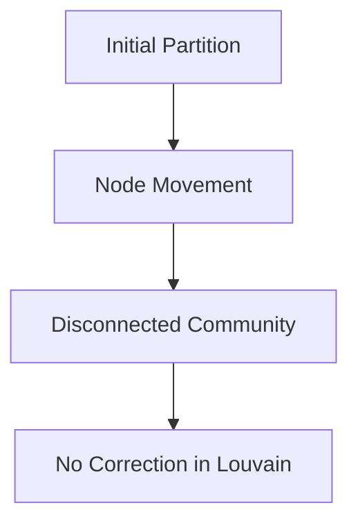
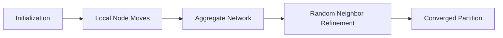

# The Leiden Algorithm: Ensuring Well-Connected Communities in Network Analysis

The **Leiden algorithm** is a significant advancement in community detection for network analysis, addressing critical limitations of the widely used **Louvain algorithm**. This article explains the problem with the Louvain method, introduces the Leiden algorithm, and highlights its advantages in terms of performance, guarantees, and scalability.

---

## The Problem with the Louvain Algorithm

The Louvain algorithm is a popular heuristic for optimizing modularity and other quality functions in community detection. It operates in two phases: **local node movement** to improve the quality function and **network aggregation** to form a higher-level representation of communities. However, this approach has a critical flaw:

### Disconnected Communities
The Louvain algorithm may produce **internally disconnected communities**, especially when run iteratively. For example, moving a single node can split a community into disconnected subgraphs, even if the remaining nodes are locally optimally assigned (see [AI product quality challenges](../06-Eval-Lifecycle/Evals-Are-NOT-All-You-Need.md) for similar issues in AI systems).

### Example
Consider a community where moving a single node causes the remaining nodes to form disconnected subgraphs. The Louvain algorithm may fail to detect this, leading to partitions that are **structurally invalid** for analysis.

This issue undermines the reliability of community detection in large and complex networks.

---

## The Leiden Algorithm: A Better Approach

The **Leiden algorithm** improves upon the Louvain method by ensuring **connected communities** and providing **explicit guarantees** about the quality of the partitions it produces. Key features include:

### 1. **Guaranteed Connected Communities**
The Leiden algorithm ensures that **all communities are internally connected**, even after iterative runs. This eliminates the risk of disconnected subgraphs, which is critical for applications like social network analysis, biological pathway mapping, and recommendation systems.

### 2. **Convergence to Locally Optimal Partitions**
The algorithm converges to a partition where **all subsets of communities are locally optimally assigned**, providing an upper bound on the quality of the optimal partition.

### 3. **Faster Execution**
By incorporating **fast local move strategies** and **random neighbor moves**, the Leiden algorithm outperforms the Louvain method in terms of speed, especially for large networks.

---

## How the Leiden Algorithm Works

The Leiden algorithm builds on the Louvain framework but introduces critical improvements:

1. **Initialization**: Start with a singleton partition (each node is its own community).
2. **Local Moves**: Move nodes to maximize the quality function (e.g., modularity or CPM).
3. **Aggregation**: Create an aggregate network where each community becomes a node.
4. **Refinement**: Apply a **random neighbor move** to ensure connectedness and avoid local optima.
5. **Iteration**: Repeat until no further improvements are possible.

This process ensures that communities are both **high-quality** and **structurally sound**.

---

## Comparison: Louvain vs. Leiden

| Feature                  | Louvain Algorithm              | Leiden Algorithm                  |
|-------------------------|-------------------------------|-----------------------------------|
| **Connected Communities** | No (may produce disconnected) | Yes (guaranteed connected)        |
| **Convergence**          | Local optima only             | Converges to locally optimal partitions |
| **Speed**                | Fast                        | Faster (due to optimizations)     |
| **Guarantees**           | None                        | Explicit guarantees on output     |

---

## Applications and Impact

The Leiden algorithm has been tested on **benchmark and real-world networks**, demonstrating superior performance compared to the Louvain method. It is particularly useful in:

- **Social network analysis** (e.g., detecting communities in Twitter or Facebook)
- **Biological networks** (e.g., protein interaction graphs)
- **Recommendation systems** (e.g., grouping users with similar preferences)

By ensuring **connected and high-quality communities**, the Leiden algorithm provides a more reliable foundation for downstream tasks like visualization, clustering, and anomaly detection.

---

## Conclusion

The Leiden algorithm represents a major step forward in community detection, addressing the critical limitations of the Louvain method. Its guarantees on connectedness, speed, and convergence make it a **preferred choice** for researchers and practitioners working with complex networks. For further reading, see the original paper: **[From Louvain to Leiden: guaranteeing well-connected communities](https://www.example.com/leiden-paper)**.
