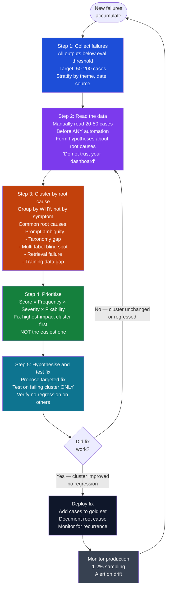
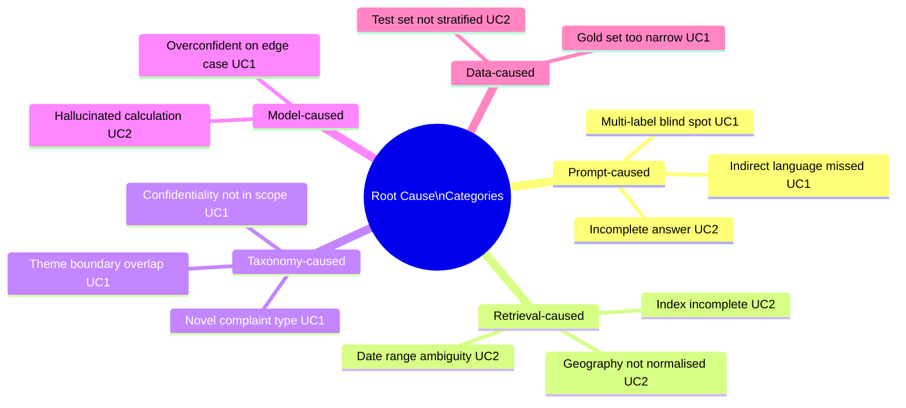

# Diagram: Error Analysis Workflow

*The 5-step error analysis loop — the highest ROI technique in AI engineering.*

---

---

## Root cause taxonomy for both use cases

---

## Prioritisation scorecard

| Cluster | Freq (1-3) | Severity (1-3) | Fixable (1-3) | Score | Fix |
|---|---|---|---|---|---|
| Multi-label gap (UC1) | 3 | 3 | 3 | **9** | Prompt: allow list output |
| Hallucinated % (UC2) | 3 | 3 | 3 | **9** | Prompt: citation required |
| Underquoting/Advertising boundary (UC1) | 2 | 2 | 3 | **12→6** | Add boundary examples |
| Geography not normalised (UC2) | 2 | 3 | 2 | **12→8** | Engineering: normalise index |
| Indirect honesty language (UC1) | 2 | 3 | 3 | **18→7** | Add few-shot examples |

---

*Source: Hamel Husain — Error Analysis (YouTube) | Highest ROI Technique article*

*Back to: [Diagrams index](Eval-Pipeline-Architecture)*
