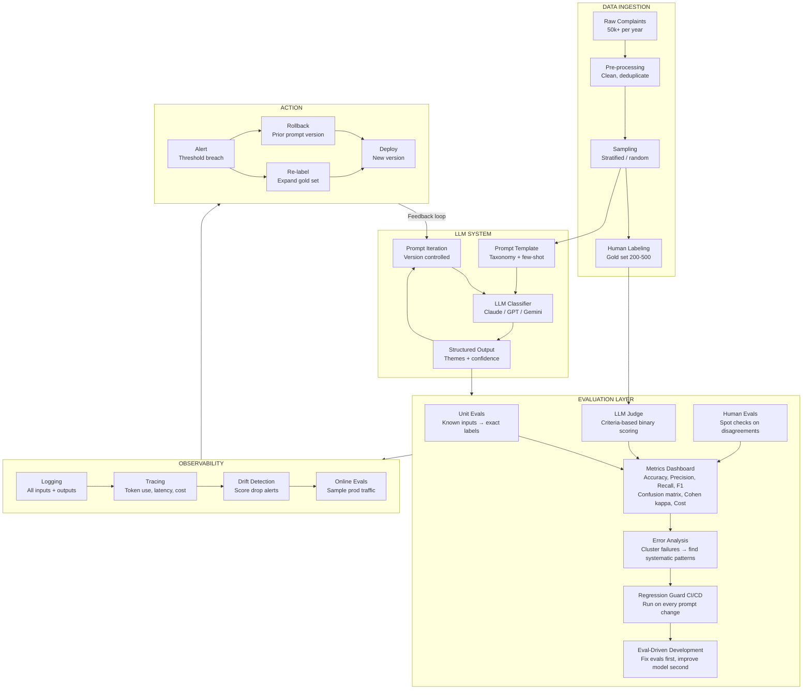

# Diagram: Eval Pipeline Architecture

*Full end-to-end evaluation pipeline for the complaint classification system (UC1).*
*The standalone SVG version of this diagram is also available in the course materials.*

---

---

## Design principles encoded in this diagram

| Principle | Source | Where in diagram |
|---|---|---|
| Start with unit evals before LLM judges | Hamel Husain | UE → LJ ordering |
| Binary scoring over Likert | Decodingai.com | LLM Judge criteria |
| Error analysis is highest ROI | Hamel Husain (YouTube) | EA as central hub |
| Eval-driven development | Decodingai.com | EDD feedback loop |
| LLM judges need validation | eugeneyan.com | Human Evals → calibration |
| Online evals close the loop | Anthropic | Observability layer |
| Avoid generic metrics | Decodingai.com | Metrics Dashboard specificity |
| Evals alone not enough | O'Reilly / Reganti | Observability + Action layers |

---

*Next diagram: [LLM Judge Setup](LLM-Judge-Setup)*
