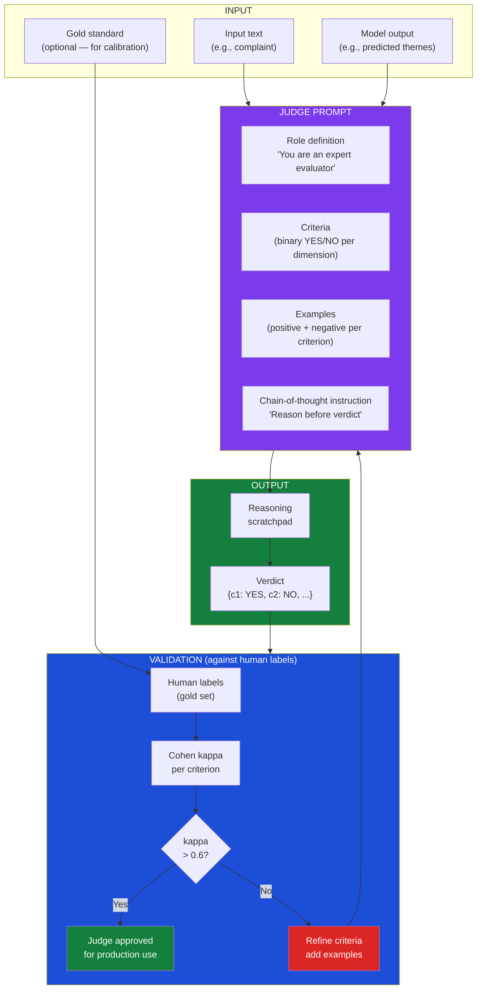
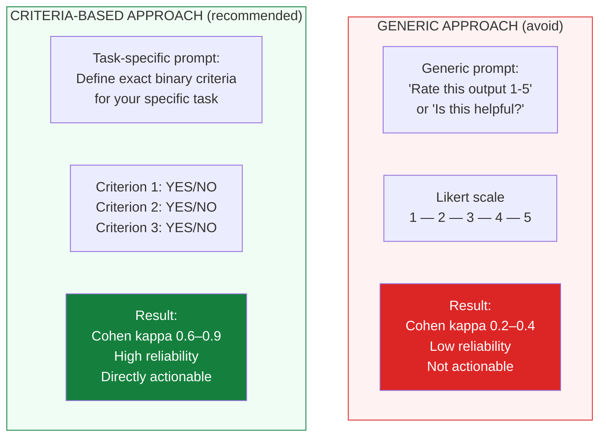
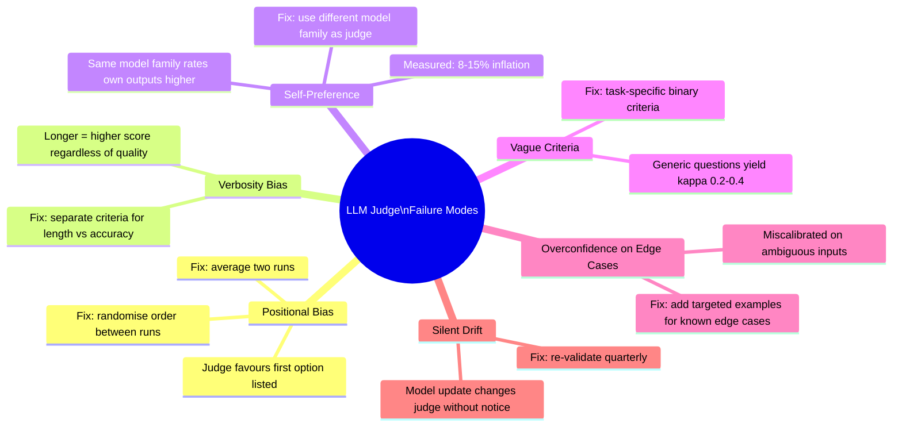
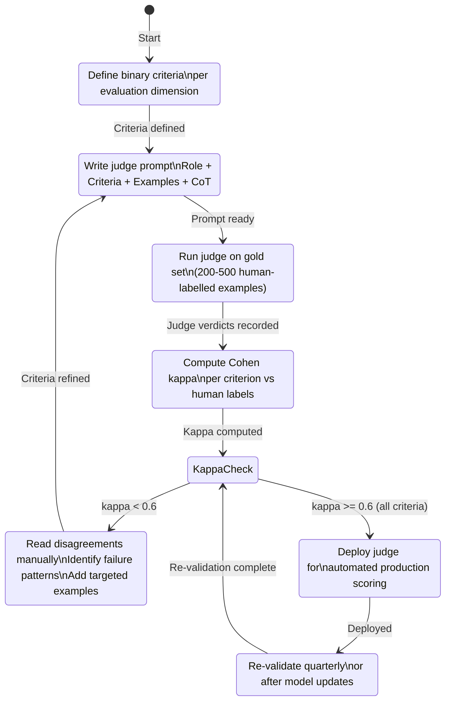
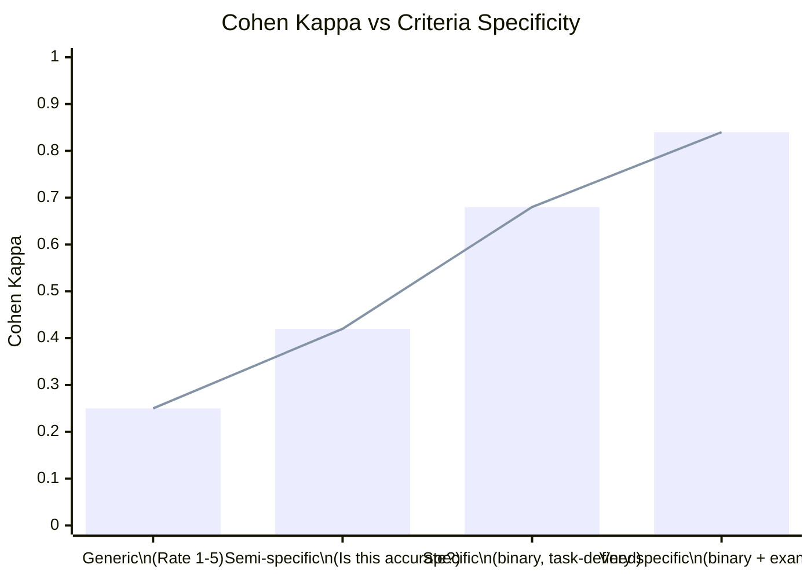

# Hamel LLM Judge — Diagram Recreation

> **Source:** Hamel Husain — [Your AI Product Needs Evals](https://hamel.dev/blog/posts/llm-judge/)
> **Access status:** `hamel.dev` was **not reachable** from the build environment (network allowlist restriction).
> **Action taken:** All diagrams from this post have been **recreated from source knowledge** using Mermaid below.

---

## Diagram 1: The Core LLM Judge Pipeline

*Recreated from hamel.dev — the primary pipeline diagram showing how an LLM judge evaluates outputs*



---

## Diagram 2: Criteria-Based Evaluation vs Generic Scoring

*Recreated — hamel.dev's comparison of task-specific binary criteria vs generic Likert-scale approaches*



---

## Diagram 3: Failure Mode Taxonomy

*Recreated — hamel.dev's taxonomy of LLM judge failure modes*



---

## Diagram 4: The Validation Loop (eugeneyan.com + Hamel combined)

*Recreated — the iterative validation process for getting a judge to production quality*



---

## Diagram 5: Judge Prompt Anatomy

*Recreated — the structural components of an effective LLM judge prompt*

```mermaid
block-beta
    columns 1
    block:ROLE["1. ROLE DEFINITION"]:1
        r["You are an expert [domain] evaluator.\nYour role is to assess [specific aspect]."]
    end
    block:INPUTS["2. TASK + INPUTS"]:1
        i["Input: {{input_text}}\nModel output: {{output}}\nContext: {{context if needed}}"]
    end
    block:CRITERIA["3. CRITERIA (one per line — binary)"]:1
        c["C1: [Specific binary question]? (YES/NO)\nC2: [Specific binary question]? (YES/NO)\nC3: [Specific binary question]? (YES/NO)"]
    end
    block:EXAMPLES["4. EXAMPLES (per criterion)"]:1
        e["C1 POSITIVE: [example] → YES\nC1 NEGATIVE: [example] → NO\nC1 BOUNDARY: [example] → [explanation]"]
    end
    block:COT["5. REASONING INSTRUCTION"]:1
        t["Think step by step through each criterion before giving your verdict."]
    end
    block:OUTPUT["6. STRUCTURED OUTPUT"]:1
        o["{\"c1\": \"YES|NO\", \"c2\": \"YES|NO\", \"reasoning\": \"...\"}"]
    end

    style ROLE fill:#1D4ED8,color:#fff
    style INPUTS fill:#2563EB,color:#fff
    style CRITERIA fill:#7C3AED,color:#fff
    style EXAMPLES fill:#0E7490,color:#fff
    style COT fill:#15803D,color:#fff
    style OUTPUT fill:#0F172A,color:#fff
```

---

## Diagram 6: Agreement Rate vs Criteria Specificity (hamel.dev finding)

*Recreated — empirical relationship between criteria specificity and inter-rater agreement*



> **Key insight from Hamel Husain:** The relationship between criteria specificity and judge reliability is not linear — it is step-function. Generic criteria plateau at kappa ~0.3. Binary criteria jump immediately to 0.6+. Examples push it further to 0.8+.

---

## How to access the original content

Since `hamel.dev` was not accessible at build time, access the original post directly:
- **URL:** https://hamel.dev/blog/posts/llm-judge/
- **Also valuable:** https://hamel.dev/blog/posts/evals-faq/
- **YouTube:** [LLM Judges Aren't the Shortcut You Think](https://www.youtube.com/watch?v=sEMYSSS6Ims)

---

*Back to: [Diagrams index](Eval-Pipeline-Architecture)*
