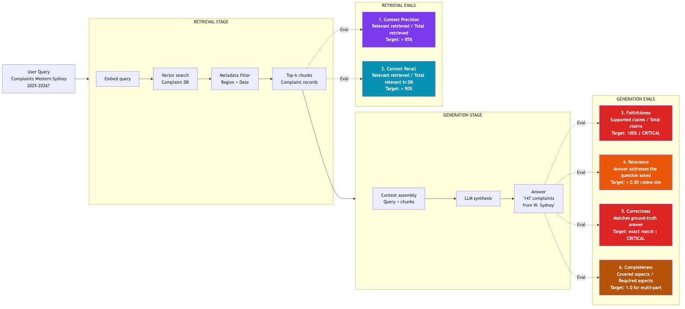
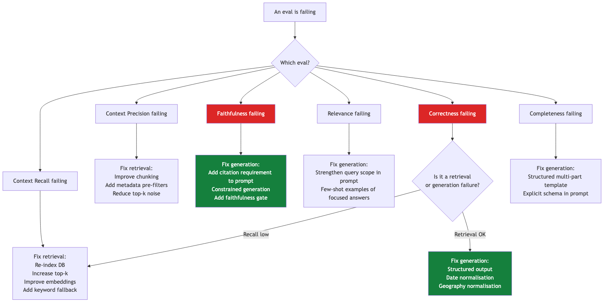

# Diagram: RAG Evals Framework

*The 6 RAG evals mapped to the complaints chatbot pipeline.*

---

---

## Fix decision tree: when an eval fails

---

*Source: Jason Liu (jxnl.co) — There Are Only 6 RAG Evals | Anthropic — Demystifying Evals for AI Agents*

*Next diagram: [Error Analysis Workflow](Error-Analysis-Workflow)*
