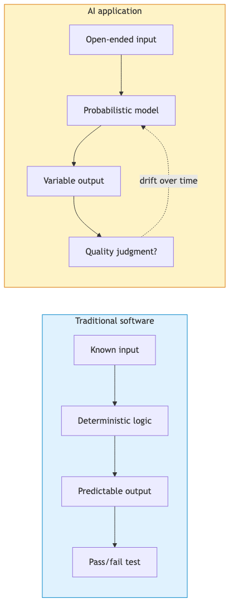
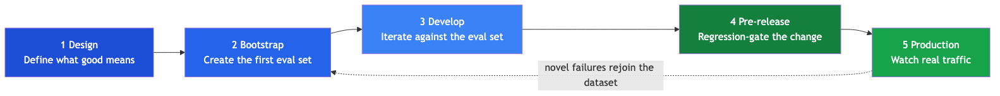
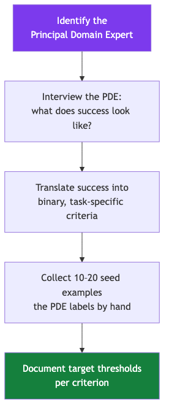
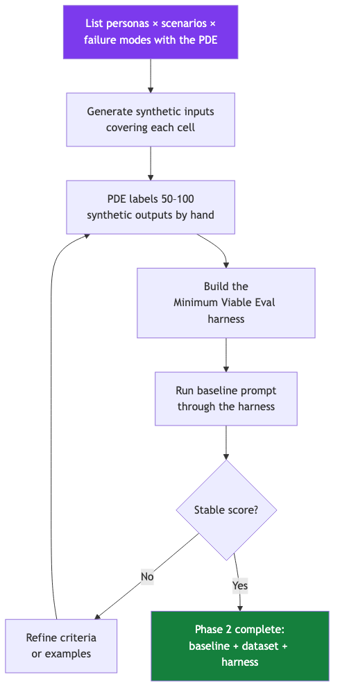
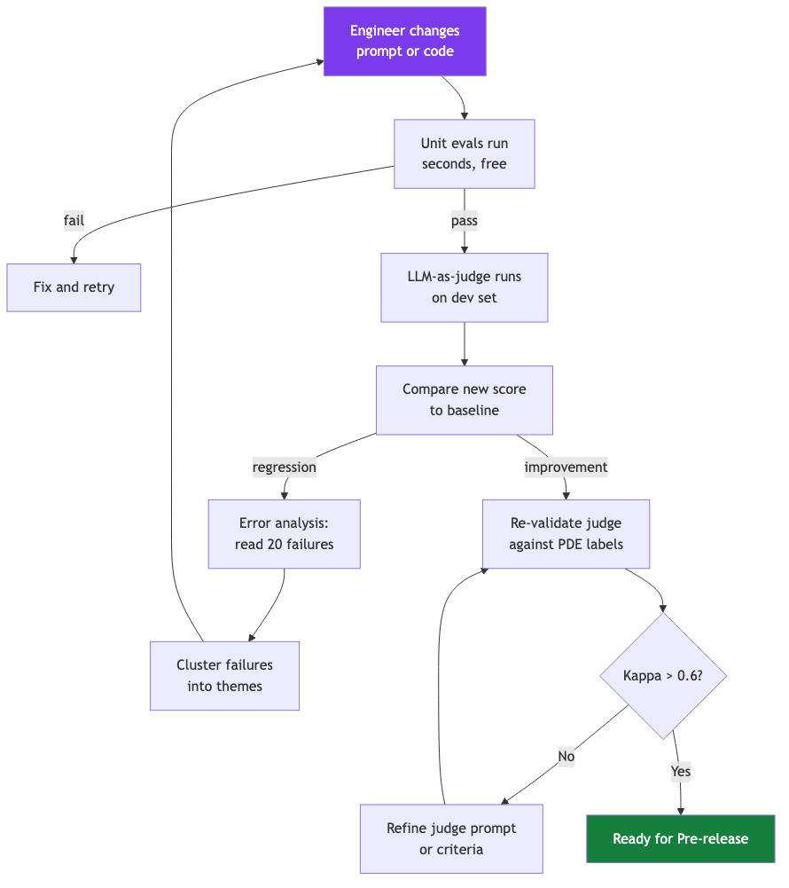
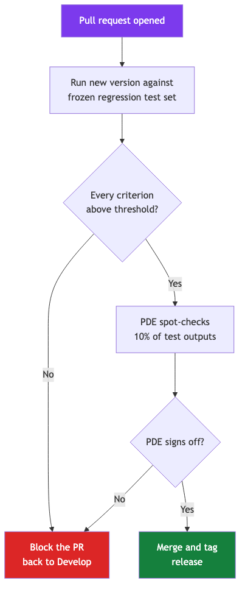
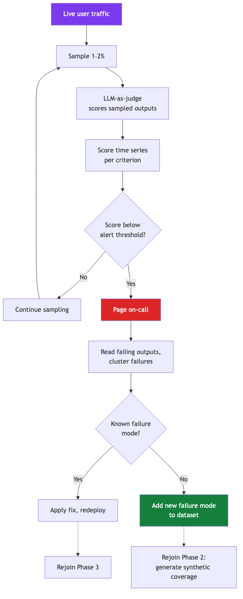
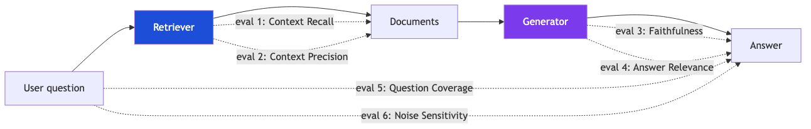

# AI Evaluation Lifecycle — A Briefing

This page explains, end-to-end, how teams evaluate AI applications from the first design conversation through years of production traffic. It is meant to give a reader enough understanding of the moving parts — vocabulary, sequence, decisions, tradeoffs — to reason confidently about how their organisation should handle AI evaluation.

---

## Contents

1. [What AI evaluation is — and why it is not software testing](#1-what-ai-evaluation-is--and-why-it-is-not-software-testing)
2. [The lifecycle at a glance](#2-the-lifecycle-at-a-glance)
3. [The lifecycle in depth](#3-the-lifecycle-in-depth)
   - [3.1 Design — define what "good" means before any code exists](#31-design--define-what-good-means-before-any-code-exists)
   - [3.2 Bootstrap — create the first eval set when no production data exists](#32-bootstrap--create-the-first-eval-set-when-no-production-data-exists)
   - [3.3 Develop — iterate prompts and code against the eval set](#33-develop--iterate-prompts-and-code-against-the-eval-set)
   - [3.4 Pre-release — gate the change against a frozen test set](#34-pre-release--gate-the-change-against-a-frozen-test-set)
   - [3.5 Production — sample real traffic, alert on drift, close the loop](#35-production--sample-real-traffic-alert-on-drift-close-the-loop)
4. [Specialised cases](#4-specialised-cases)
   - [4.1 RAG applications](#41-rag-applications)
   - [4.2 Agentic systems](#42-agentic-systems)
5. [Concept dictionary](#5-concept-dictionary)
6. [The open decisions this briefing surfaces](#6-the-open-decisions-this-briefing-surfaces)
7. [Deeper reading](#7-deeper-reading)

---

## 1. What AI evaluation is — and why it is not software testing

Traditional software is deterministic: the same input produces the same output, errors come with stack traces, and a test that passes today will pass tomorrow unless someone changes the code. AI applications break all three properties. The same prompt to the same model can produce different outputs minute to minute. Failures arrive as confident-sounding wrong answers rather than exceptions. And model behaviour drifts silently — a vendor updates a checkpoint, a retrieval index grows, user phrasing shifts, and quality erodes without a single line of code changing.

**AI evaluation** is the discipline of turning subjective quality judgments ("does this answer feel right?") into measurable, auditable evidence ("84% of complaints were classified using only valid taxonomy terms last week, down from 91% the week before"). Without it, teams operate on what the field calls **"vibe checking"** — the founder reads ten outputs, decides things look fine, and ships. Vibe checking does not survive contact with real users.

> *"Without evals, you are flying blind. With bad evals, you are flying with a broken altimeter."* — Hamel Husain

Deeper reading: [Why Evals Matter](01-Foundations/Why-Evals-Matter.md), [Eval Types Overview](01-Foundations/Eval-Types-Overview.md), [Mirage of Generic Metrics](04-Metrics-and-Scoring/Mirage-of-Generic-Metrics.md).

---

## 2. The lifecycle at a glance

AI evaluation runs across five phases that map onto how a feature actually moves from idea to live traffic. The phases are not stages in a Gantt chart — they are recurring activities. Every prompt change re-enters Develop; every released version gets monitored in Production; every novel failure spotted in Production loops back to refresh the Bootstrap dataset. The lifecycle is a circle, not a line.

In one sentence each:

1. **Design** — agree on what "good" means before writing any code.
2. **Bootstrap** — create a starter eval set when no production data exists yet.
3. **Develop** — iterate prompts and code against the eval set, with automated judges scoring each change.
4. **Pre-release** — gate the change against a frozen test set the engineer never saw during development.
5. **Production** — sample live traffic continuously, alert on drift, feed novel failures back to the dataset.

The next section walks each phase in depth.

---

## 3. The lifecycle in depth

### 3.1 Design — define what "good" means before any code exists

The most common cause of a failed AI eval programme is starting too late. Teams build the model, deploy it, then try to figure out how to measure it — by which point everyone has formed a private opinion of what the system "should" do, and those opinions disagree. Design phase prevents this by writing down the answer before code exists.

**Concepts introduced here:**

- **Principal Domain Expert (PDE)** — *the single person whose judgment defines whether the AI's output is acceptable for this use case.* For a complaint classifier, the PDE is a regulatory officer. For a medical chatbot, a clinician. For a legal assistant, a lawyer. Teams that try to crowd-source "good" across a committee usually end up with criteria so vague nobody can apply them.
- **Criterion** — *one specific, binary question a reader can ask of an AI output.* "Did the answer cite only documents that were retrieved?" is a criterion. "Was the answer helpful?" is not — two readers will disagree on what counts.
- **Binary criterion** — *a criterion answerable strictly YES or NO.* Binary scoring sounds reductive, but it produces far higher inter-rater agreement than five-star scales, where the difference between a 3 and a 4 is undefined. See [Binary vs Likert](04-Metrics-and-Scoring/Binary-vs-Likert.md).
- **Threshold** — *the minimum score the team agrees the system should reach on a criterion before being considered usable.*

| What "good" looks like in Design | What "bad" looks like |
|---|---|
| One named PDE, available, signed off | "We'll figure out who reviews this later" |
| 5–10 binary criteria, each with examples | One vague criterion: "Is the output high quality?" |
| Written threshold per criterion (e.g. ≥ 90%) | No thresholds — "we'll know it when we see it" |
| 10–20 seed examples labelled by the PDE | Zero labelled examples; engineers self-label |

Deeper reading: [Why Evals Matter](01-Foundations/Why-Evals-Matter.md), [Eval Maturity Ladder](01-Foundations/Eval-Maturity-Ladder.md), [LLM as Judge Complete Guide](03-LLM-Judges/LLM-as-Judge-Complete-Guide.md) (Steps 1–2 of the Hamel guide).

---

### 3.2 Bootstrap — create the first eval set when no production data exists

When a feature is brand new, there is no production traffic to learn from. Teams that wait for "real data" never start. The Bootstrap phase manufactures the dataset using **synthetic data** — model-generated inputs designed to cover the personas, scenarios, and failure modes the PDE expects in production — and pairs each synthetic input with a label produced by hand.

**Concepts introduced here:**

- **Synthetic data** — *AI-generated inputs designed to fill gaps that real traffic has not produced yet.* Used correctly, it accelerates the cold start. Used naively, it produces an eval set that only tests inputs the model is already good at — because the same kind of model wrote them. The discipline is to generate against an explicit **persona × scenario × failure-mode** matrix rather than freeform.
- **Persona × scenario × failure-mode matrix** — *the three-axis grid teams enumerate before generating synthetic inputs.* Persona: who is asking (busy professional, elderly user, non-native speaker). Scenario: what they want (track an order, cancel a booking, escalate a complaint). Failure mode: how the system might break (ambiguous query, missing data, multi-turn confusion). Coverage = at least one input per non-empty cell.
- **Eval set** — *the curated collection of inputs + expected outcomes the team uses to score every change.* Distinct from the **gold set** introduced in the next phase.
- **Eval harness** — *the code that loads inputs, runs the model, runs the scoring functions, and aggregates results.* It is infrastructure, not insight. A harness without good criteria is just expensive vibe-checking.
- **Minimum Viable Eval (MVE)** — *the smallest possible harness that runs end-to-end.* Often a Python script and a JSON file. The point of the MVE is to start producing scores before perfect tooling exists.

| What "good" looks like in Bootstrap | What "bad" looks like |
|---|---|
| Coverage matrix written before generation | "Generate 1000 examples and pick the best" |
| 50–100 PDE-labelled examples in hand | Engineers self-label to save time |
| MVE returns a number you can re-run | Evaluation is a manual notebook session |
| Baseline score is documented and stable | No baseline — every comparison is anecdotal |

Deeper reading: [build an ai evals dataset from scratch](02-Building-Evals/build-an-ai-evals-dataset-from-scratch.md), [Generate Synthetic Datasets](02-Building-Evals/Generate-Synthetic-Datasets.md), [evaluation driven development edd framework](06-Eval-Lifecycle/evaluation-driven-development-edd-framework.md).

---

### 3.3 Develop — iterate prompts and code against the eval set

Once the harness produces a stable score, every change to the application — a new prompt, a different model, a tweaked retrieval setting — is judged by whether the score moves up or down. Development becomes empirical instead of intuitive. This is the phase where most of the engineering effort lives, and where two distinct types of evaluator do the work: cheap deterministic checks called **unit evals**, and a second AI scoring the first AI, called an **LLM-as-judge**.

**Concepts introduced here:**

- **Unit eval** — *a deterministic, code-only check that returns true or false in milliseconds.* Examples: "the JSON parses", "the predicted theme appears in the official taxonomy", "the answer mentions the queried date range". Unit evals are free, fast, and unforgiving — exactly the qualities a regression test needs.
- **LLM-as-judge** — *a second language model scoring the first model's output against the criteria written in Design.* It scales human judgment to thousands of examples for the cost of an API call. It also introduces failure modes — bias toward longer outputs, preference for outputs from its own model family, sensitivity to ordering — that have known mitigations. See [LLM as Judge Complete Guide](03-LLM-Judges/LLM-as-Judge-Complete-Guide.md).
- **Gold set** — *the subset of the eval set the PDE has personally labelled, used as ground truth for validating the judge.* Industry practice is 100–500 examples, partitioned 60/20/20 into train, dev, and test.
- **Train / dev / test split** — *partitioning the gold set so the judge's prompt is built from train, tuned on dev, and scored only once on test at the end.* Skipping the split and scoring on the same examples used to write the prompt produces optimistic numbers that fall apart in production.
- **Cohen's kappa** — *a statistic measuring how much the judge agrees with the PDE beyond what chance alone would predict.* Kappa above 0.6 is treated as strong agreement; below 0.4 is treated as the judge essentially guessing. The 0.6 threshold is the field's working consensus, not a law of physics.
- **Error analysis** — *the highest-ROI activity in this phase.* A human reads twenty failing outputs, clusters them into themes, and the cluster names become the next round of criteria or fix targets. See [Overview](05-Error-Analysis/Overview.md).

| What "good" looks like in Develop | What "bad" looks like |
|---|---|
| Unit evals run on every commit | Judges run on every commit (slow + expensive) |
| Judge validated to kappa > 0.6 vs PDE | Judge deployed without ever being scored against humans |
| Gold set split 60/20/20, test held back | Judge tuned on the same examples it is scored on |
| Failures clustered into named themes | Failures treated as one-off curiosities |

Deeper reading: [LLM as Judge Complete Guide](03-LLM-Judges/LLM-as-Judge-Complete-Guide.md), [Validation Protocol](03-LLM-Judges/Validation-Protocol.md), [Overview](05-Error-Analysis/Overview.md), [Binary vs Likert](04-Metrics-and-Scoring/Binary-vs-Likert.md).

---

### 3.4 Pre-release — gate the change against a frozen test set

Develop optimises against a known set of examples — the dev set. That creates a subtle hazard: prompts get tuned until they pass the dev set, even when the underlying behaviour has not generalised. Pre-release exists to catch this. The team holds back a **regression test set** the engineer never sees during Develop, runs the new version against it, and only promotes the change if the score clears a threshold *and* the PDE personally signs off on a sampled fraction.

**Concepts introduced here:**

- **Regression test set** — *a curated set of inputs and expected outcomes locked at a point in time, used to verify a new version does not silently break behaviour the previous version got right.* The defining property is that the engineer cannot peek at it during Develop. If the engineer can see it, they will tune to it, and its purpose collapses.
- **Threshold per criterion** — *the per-criterion bar set in Design, applied here as a hard gate.* Aggregate scores hide regressions in narrow but important slices — for example, overall accuracy can rise while accuracy on the rarest theme falls to zero.
- **PDE spot-check** — *the human review of a sample of pre-release outputs by the Principal Domain Expert.* This is the only point in the lifecycle where a human looks at every-version output before it ships. It catches the failures the judge has not been taught to catch yet.

| What "good" looks like in Pre-release | What "bad" looks like |
|---|---|
| Regression set never edited mid-PR | Regression set re-curated to make the PR pass |
| Hard threshold on every criterion | Average score "looks fine" |
| PDE sign-off recorded against version | Sign-off implicit / verbal / lost |

Deeper reading: [Integrating Evals](06-Eval-Lifecycle/Integrating-Evals.md), [Evals Are NOT All You Need](06-Eval-Lifecycle/Evals-Are-NOT-All-You-Need.md), [Eval Design Checklist](Checklists/Eval-Design-Checklist.md).

---

### 3.5 Production — sample real traffic, alert on drift, close the loop

A version that passes Pre-release is not a finished system; it is a hypothesis. Production turns the hypothesis into evidence by sampling a slice of live traffic — typically 1–2% — and running the same judge that gated the release. Scores are tracked over time. When they fall, alerts fire. When the on-call engineer triages the alert, novel failure modes are added to the dataset, which feeds back into the next Bootstrap–Develop–Pre-release pass. That feedback arrow is what makes the lifecycle a loop instead of a one-way pipeline.

**Concepts introduced here:**

- **Sampling rate** — *the fraction of live traffic on which the judge runs.* Industry practice settles around 1–2%; higher rates produce sharper drift signals but cost more in tokens and latency.
- **Drift** — *a sustained shift in score over time on otherwise-similar traffic.* Drift can come from the user side (new query patterns), the data side (retrieval indexes growing stale), or the model side (vendor checkpoint update). Detecting drift requires baselines from earlier weeks, not just current scores.
- **Alert threshold** — *the size of score drop that triggers paging.* Common shapes: ">5% drop sustained for 7 days" or "any criterion below threshold for 24 hours". Tighter alerts catch issues earlier but produce more noise.
- **Novel failure mode** — *a failure pattern not covered by the existing eval set.* Once recognised, it becomes a new row in the persona × scenario × failure-mode matrix, generates new synthetic examples, and grows the dataset for the next iteration. This is how the eval set stays alive.
- **Loop closure** — *the practice of feeding production findings back into Bootstrap.* Without it, the dataset rots: it tests for failures that no longer occur and misses failures that do. With it, the eval programme compounds.

| What "good" looks like in Production | What "bad" looks like |
|---|---|
| Sampling runs continuously, not in batches | "We'll evaluate at the next quarterly review" |
| Drift alerts go to a paged on-call | Alerts fire into an unread Slack channel |
| Novel failures end up as dataset rows | Novel failures end up as Jira tickets and die |
| Judge re-validated against PDE quarterly | Judge calibration assumed to hold forever |

Deeper reading: [behind the scenes of ai observability in production](06-Eval-Lifecycle/behind-the-scenes-of-ai-observability-in-production.md), [mlflow tracing genai observability](09-Tools-and-Platforms/mlflow-tracing-genai-observability.md), [Demystifying Agent Evals](07-Agent-Evals/Demystifying-Agent-Evals.md).

---

## 4. Specialised cases

The five-phase lifecycle holds for any AI application. Two architectures add specialised concerns on top: **retrieval-augmented generation** (RAG) and **agentic systems**.

### 4.1 RAG applications

A RAG system answers user questions by first retrieving documents from a corpus and then asking a language model to compose an answer grounded in those documents. The lifecycle is the same; the criteria are richer because two pipeline stages can fail independently — retrieval can return the wrong documents, or the model can ignore the right ones. The field has settled on six specific evals that together cover the failure surface.

The six evals, in plain language:

1. **Context Recall** — did the retriever fetch the documents that actually contain the answer?
2. **Context Precision** — of the documents fetched, how many were relevant?
3. **Faithfulness** — does every claim in the answer trace back to a retrieved document?
4. **Answer Relevance** — does the answer address what was asked?
5. **Question Coverage** — for multi-part questions, are all parts addressed?
6. **Noise Sensitivity** — does the system stay correct when irrelevant documents are mixed into the retrieved set?

In the lifecycle, all six become criteria written in Design, generated against in Bootstrap, judged in Develop, gated in Pre-release, and monitored in Production. Deeper reading: [UC2 The 6 RAG Evals](08-Applied-Implementation/UC2-The-6-RAG-Evals.md), [RAG Eval Coverage Checklist](Checklists/RAG-Eval-Coverage-Checklist.md).

### 4.2 Agentic systems

An agentic system takes multiple steps — calling tools, reading their outputs, deciding the next call — to fulfil a single user goal. Evaluation has to look at the whole **trajectory** (the sequence of steps), not just the final output. New criteria appear in Develop and Production: did the agent pick the right tool? did it loop unnecessarily? did it stop when it should have? did it pass safe arguments to each tool? The five-phase shape is unchanged; the criteria multiply. Deeper reading: [Demystifying Agent Evals](07-Agent-Evals/Demystifying-Agent-Evals.md).

---

## 5. Concept dictionary

A consolidated reference for every term used above. Each entry says what the concept *is* in plain language and *why it matters* for someone reasoning about how the lifecycle should run.

| Term | Plain-language definition | Why it matters |
|---|---|---|
| **Principal Domain Expert (PDE)** | The single named person whose judgment defines acceptable output for a use case. | Without one, "good" cannot be operationalised. |
| **Criterion** | One specific, binary question asked of every output. | Criteria turn taste into evidence. |
| **Threshold** | The minimum agreed score for a criterion. | Thresholds are the gate; without them the score is just a number. |
| **Eval set** | The curated inputs + expected outcomes used to score every change. | The eval set defines what "passing" actually tests. |
| **Gold set** | The subset of the eval set personally labelled by the PDE. | The gold set is ground truth for validating judges. |
| **Train / dev / test split** | 60/20/20 partition of the gold set: train builds the judge, dev tunes it, test scores it once. | Skipping the split inflates measured accuracy. |
| **Eval harness** | The code that runs inputs, model, scorers, aggregation. | Without a harness, evaluation is a manual notebook session that does not survive a vacation. |
| **Minimum Viable Eval (MVE)** | The smallest harness that returns a re-runnable score. | Starts the loop before perfect tooling exists. |
| **Synthetic data** | Model-generated inputs designed to cover the persona × scenario × failure-mode matrix when no production data exists. | Cold-starts the eval set; misused, it tests only what the model is already good at. |
| **Persona × scenario × failure-mode matrix** | The three-axis grid teams enumerate before generating synthetic inputs. | Forces explicit coverage rather than freeform generation. |
| **Unit eval** | A deterministic, code-only check returning true or false. | Cheap, fast, perfect for regressions. |
| **LLM-as-judge** | A second model scoring the first against written criteria. | Scales human judgment; introduces known biases. |
| **Cohen's kappa** | Agreement between judge and PDE beyond chance, on a −1 to 1 scale. | Above 0.6 = strong; below 0.4 = essentially guessing. |
| **Error analysis** | A human reads ~20 failures, clusters them, names the clusters. | The single highest-ROI activity in the lifecycle. |
| **Regression test set** | A frozen set held back during Develop, used at Pre-release only. | If the engineer can see it, it does not regression-test. |
| **PDE spot-check** | The PDE personally reviews a sample of pre-release outputs. | The last human-in-the-loop gate before traffic. |
| **Sampling rate** | The fraction of live traffic the judge scores in Production. | Sets the resolution of the drift signal. |
| **Drift** | A sustained score change over time on similar traffic. | The defining failure mode of deployed AI; only continuous evaluation catches it. |
| **Alert threshold** | The score drop that pages on-call. | Sets the noise / latency tradeoff. |
| **Novel failure mode** | A failure pattern not yet in the eval set. | Recognising and re-using it is what closes the lifecycle loop. |
| **Loop closure** | Feeding production findings back into Bootstrap. | The difference between a living eval programme and a stale one. |
| **Trajectory** (agents) | The sequence of tool calls and intermediate outputs an agent produces. | For agents, evaluation looks at the path taken, not just the final destination. |

---

## 6. The open decisions this briefing surfaces

A reader who has absorbed §1–§5 will notice the lifecycle leaves several decisions unspecified — intentionally. Different organisations resolve them differently, and the right answer depends on team size, regulatory exposure, traffic volume, and tolerance for slow releases. Each item below is phrased as a tradeoff rather than a recommendation.

1. **Gold-set ownership.** A single named PDE produces highly consistent labels but becomes a bottleneck and a single point of failure. A labelling team scales and adds redundancy but introduces inter-rater variance that needs its own measurement.
2. **Kappa threshold for deploying a judge.** 0.6 is the field's working consensus, but high-stakes domains often raise it to 0.75 or 0.8, accepting longer judge-development cycles in exchange for tighter alignment.
3. **Sampling rate in production.** 1% is cheap and slow to detect drift; 5% is sharp but multiplies token costs and may add latency on the live path.
4. **Alert sensitivity.** Tight alerts ("any 5% drop, any criterion") catch issues early but burn on-call attention; loose alerts ("sustained 10% drop over a week") are quiet but slow.
5. **PDE spot-check fraction at Pre-release.** 10% is common; smaller fractions release faster but rely more heavily on the judge; larger fractions slow releases but provide deeper assurance.
6. **Judge re-validation cadence.** Monthly catches drift in the judge itself but consumes PDE time; quarterly is lighter but allows judge calibration to silently degrade between checks.
7. **Treatment of novel failures from production.** Treating each as a new dataset row keeps the eval programme alive but grows the cost of every full eval run; treating them as one-off bug fixes is cheap but causes the dataset to rot.
8. **Synthetic-vs-real ratio in the eval set.** A heavily synthetic set covers rare failure modes but risks measuring only what the generator is good at; a heavily real-traffic set is grounded but slow to assemble and weak on rare cases.
9. **Where the harness lives.** A vendor LLMOps platform is fast to adopt but creates lock-in; a hand-rolled harness is portable but is engineering the team has to maintain forever.
10. **Who can override the Pre-release gate.** A strict gate maximises consistency; a documented override path (with PDE sign-off) keeps the team unblocked when judgment legitimately disagrees with the judge.

These are the questions the briefing's reader will need to answer next. Each one is informed by the lifecycle above; none is settled by it.

---

## 7. Deeper reading

### The seven reference questions, each linked to its canonical article

1. **How to integrate evals across the application lifecycle** → [Integrating Evals](06-Eval-Lifecycle/Integrating-Evals.md)
2. **How to build an evals dataset from scratch** → [build an ai evals dataset from scratch](02-Building-Evals/build-an-ai-evals-dataset-from-scratch.md)
3. **How to use synthetic data correctly** → [Generate Synthetic Datasets](02-Building-Evals/Generate-Synthetic-Datasets.md)
4. **How to design evaluators (LLM-as-judge)** → [LLM as Judge Complete Guide](03-LLM-Judges/LLM-as-Judge-Complete-Guide.md)
5. **How to validate evaluators against human judgment** → [Validation Protocol](03-LLM-Judges/Validation-Protocol.md)
6. **How to evaluate RAG systems** → [UC2 The 6 RAG Evals](08-Applied-Implementation/UC2-The-6-RAG-Evals.md)
7. **What evals look like in production** → [behind the scenes of ai observability in production](06-Eval-Lifecycle/behind-the-scenes-of-ai-observability-in-production.md)

### Structural references

- [SCHEMA](SCHEMA.md) — the wiki's own reading map (folder ownership, conventions, ruled-out anti-patterns).
- [INDEX](INDEX.md) — the full machine-readable list of articles.

### The four checklists

Each is a one-page distillation usable as a pre-flight check at the relevant phase:

- [Eval Design Checklist](Checklists/Eval-Design-Checklist.md) — runs at Phase 1 (Design).
- [LLM Judge Quality Checklist](Checklists/LLM-Judge-Quality-Checklist.md) — runs at Phase 3 (Develop), before the judge is trusted.
- [Error Analysis Checklist](Checklists/Error-Analysis-Checklist.md) — runs inside Phase 3 and inside Phase 5 loop-back triage.
- [RAG Eval Coverage Checklist](Checklists/RAG-Eval-Coverage-Checklist.md) — runs for §4.1 RAG applications across all phases.

### Foundational background

If the reader wants to ground the lifecycle in first principles, three articles are the foundational reading: [Why Evals Matter](01-Foundations/Why-Evals-Matter.md), [Eval Types Overview](01-Foundations/Eval-Types-Overview.md), and [Evals Are NOT All You Need](06-Eval-Lifecycle/Evals-Are-NOT-All-You-Need.md) (which argues evaluation alone does not produce quality — process around it does).
